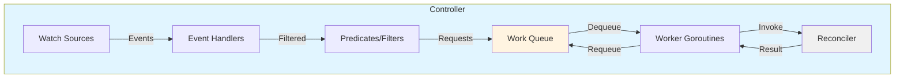
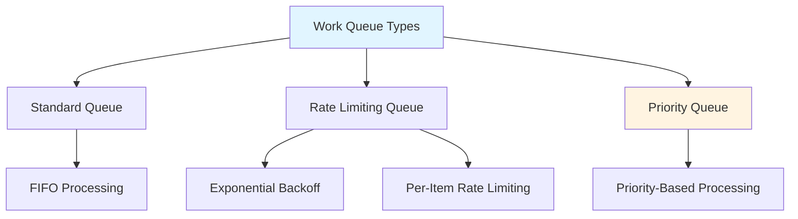
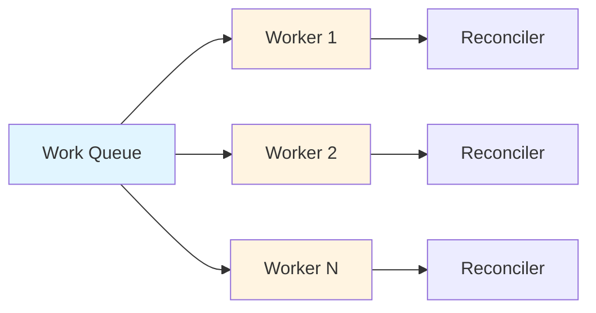
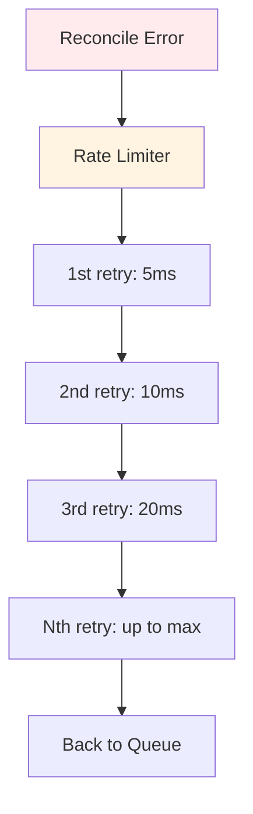
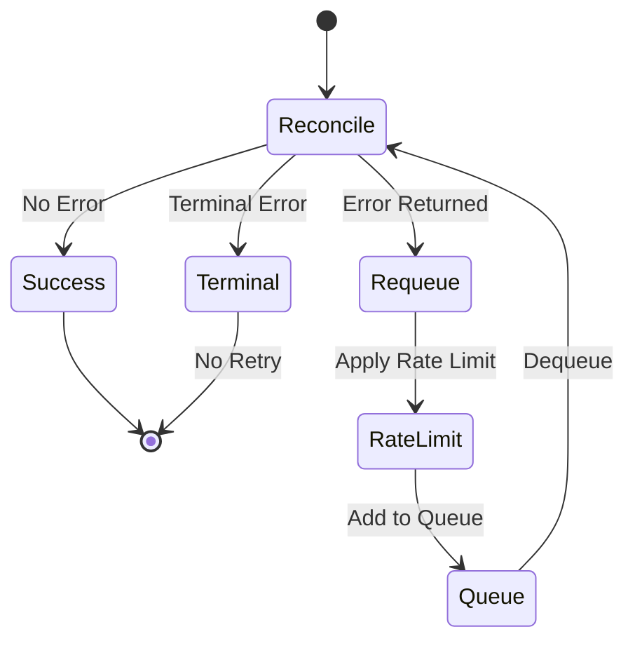
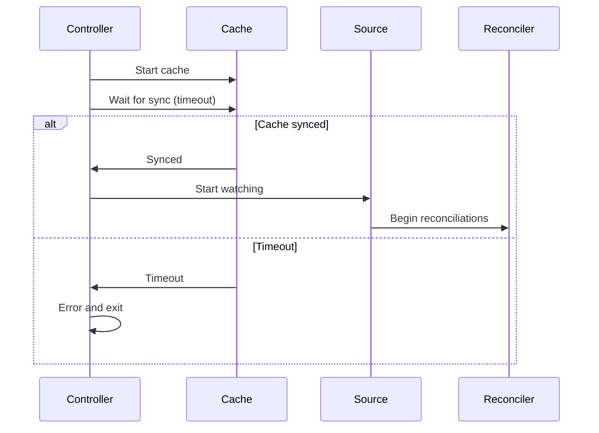
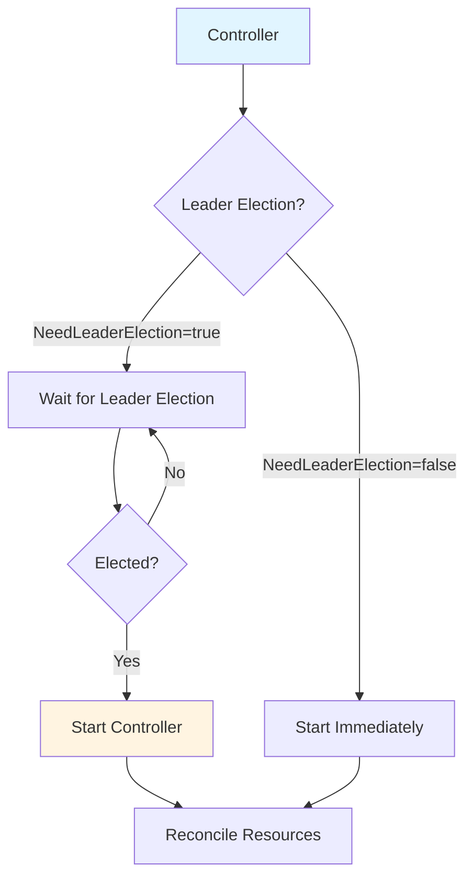

# Controller Package

## Overview

The `pkg/controller` package provides the core Controller implementation that watches Kubernetes resources, manages work queues, and invokes reconcilers. Controllers are the heart of the controller-runtime framework.

## Package Location

```
pkg/controller/
├── controller.go           # Controller interface and options
├── doc.go                  # Package documentation
├── controllerutil/         # Controller utilities (finalizers, owner references)
├── controllertest/         # Testing utilities
├── priorityqueue/          # Priority queue implementation
└── testdata/               # Test data
```

## Core Concepts

### Controller Architecture



## Controller Interface

The Controller interface defines the contract for all controllers:

```go
type Controller = TypedController[reconcile.Request]

type TypedController[request comparable] interface {
    // Reconciler is the reconciler that will be called for each request
    reconcile.TypedReconciler[request]

    // Watch watches a source of events and enqueues requests
    Watch(src source.TypedSource[request]) error

    // Start starts the controller and blocks until the context is cancelled
    Start(ctx context.Context) error

    // GetLogger returns the controller's logger
    GetLogger() logr.Logger
}
```

## Controller Options

Controllers are configured using the `TypedOptions` struct:

```go
type TypedOptions[request comparable] struct {
    // SkipNameValidation allows skipping unique name validation
    SkipNameValidation *bool

    // MaxConcurrentReconciles is the maximum number of concurrent reconciles
    // Default: 1
    MaxConcurrentReconciles int

    // CacheSyncTimeout is the timeout for waiting for cache sync
    // Default: 2 minutes
    CacheSyncTimeout time.Duration

    // RecoverPanic indicates whether to recover from panics in reconcilers
    // Default: true
    RecoverPanic *bool

    // NeedLeaderElection indicates if the controller needs leader election
    // Default: true
    NeedLeaderElection *bool

    // Reconciler is the reconciler implementation
    Reconciler reconcile.TypedReconciler[request]

    // RateLimiter for the work queue
    RateLimiter workqueue.TypedRateLimiter[request]

    // NewQueue constructs a custom queue
    NewQueue func(controllerName string, rateLimiter workqueue.TypedRateLimiter[request]) workqueue.TypedRateLimitingInterface[request]

    // Logger for the controller
    Logger logr.Logger

    // LogConstructor constructs a logger for each reconciliation
    LogConstructor func(request *request) logr.Logger

    // UsePriorityQueue enables the priority queue
    // Default: true
    UsePriorityQueue *bool

    // EnableWarmup starts sources before leader election
    // Default: false
    EnableWarmup *bool
}
```

## Creating Controllers

### Using the Builder (Recommended)

```go
import (
    ctrl "sigs.k8s.io/controller-runtime"
    "sigs.k8s.io/controller-runtime/pkg/controller"
)

// Create controller using builder
err := ctrl.NewControllerManagedBy(mgr).
    For(&corev1.Pod{}).
    WithOptions(controller.Options{
        MaxConcurrentReconciles: 5,
        RecoverPanic: ptr.To(true),
    }).
    Complete(&MyReconciler{})
```

### Direct Creation

```go
import "sigs.k8s.io/controller-runtime/pkg/controller"

// Create controller directly
c, err := controller.New("my-controller", mgr, controller.Options{
    Reconciler: &MyReconciler{},
    MaxConcurrentReconciles: 3,
})

// Add watches manually
err = c.Watch(source.Kind(mgr.GetCache(), &corev1.Pod{}, 
    &handler.EnqueueRequestForObject{}))
```

## Work Queue

### Queue Types



### Standard Queue Behavior

The default queue provides:
- **Deduplication**: Identical requests are deduplicated while in the queue
- **Rate limiting**: Exponential backoff for failed reconciliations
- **Ordered processing**: FIFO order (or priority-based with priority queue)

### Priority Queue

The priority queue allows prioritizing certain reconciliation requests:

```go
// Enable priority queue (enabled by default)
err := ctrl.NewControllerManagedBy(mgr).
    For(&corev1.Pod{}).
    WithOptions(controller.Options{
        UsePriorityQueue: ptr.To(true),
    }).
    Complete(&MyReconciler{})

// Return priority in reconcile result
func (r *MyReconciler) Reconcile(ctx context.Context, req ctrl.Request) (ctrl.Result, error) {
    // High priority items will be processed first
    return ctrl.Result{
        Priority: ptr.To(100), // Higher number = higher priority
    }, nil
}
```

## Concurrency Control

### Worker Goroutines



### Configuring Concurrency

```go
// Single worker (default)
controller.Options{
    MaxConcurrentReconciles: 1,
}

// Multiple workers for high throughput
controller.Options{
    MaxConcurrentReconciles: 10,
}
```

### Concurrency Considerations

- **Thread safety**: Reconcilers must be thread-safe when `MaxConcurrentReconciles > 1`
- **Resource contention**: More workers = more API server load
- **Ordering**: Multiple workers may process requests out of order
- **Best practice**: Start with 1, increase only if needed

## Watch Sources

Controllers watch sources of events using the `Watch` method:

```go
// Watch Pods
err = c.Watch(
    source.Kind(mgr.GetCache(), &corev1.Pod{},
        &handler.EnqueueRequestForObject{}),
)

// Watch with predicates
err = c.Watch(
    source.Kind(mgr.GetCache(), &corev1.Pod{},
        &handler.EnqueueRequestForObject{},
        predicate.GenerationChangedPredicate{}),
)
```

## Rate Limiting

### Default Rate Limiter

The default rate limiter combines:
1. **Per-item exponential backoff**: Retries with increasing delays (up to max)
2. **Overall rate limiting**: Token bucket for overall throughput



### Custom Rate Limiter

```go
import "k8s.io/client-go/util/workqueue"

// Custom rate limiter
rateLimiter := workqueue.NewItemExponentialFailureRateLimiter(
    100*time.Millisecond, // Base delay
    1*time.Minute,        // Max delay
)

err := ctrl.NewControllerManagedBy(mgr).
    For(&corev1.Pod{}).
    WithOptions(controller.Options{
        RateLimiter: rateLimiter,
    }).
    Complete(&MyReconciler{})
```

## Error Handling

### Reconcile Error Behavior



### Error Handling Patterns

```go
func (r *MyReconciler) Reconcile(ctx context.Context, req ctrl.Request) (ctrl.Result, error) {
    // 1. Transient error - will be retried with backoff
    if err := doSomething(); err != nil {
        return ctrl.Result{}, err
    }

    // 2. Requeue after specific duration (no error)
    return ctrl.Result{RequeueAfter: 5 * time.Minute}, nil

    // 3. Terminal error - no retry
    if err := validate(); err != nil {
        return ctrl.Result{}, reconcile.TerminalError(err)
    }

    // 4. Success - no requeue
    return ctrl.Result{}, nil
}
```

## Panic Recovery

Controllers can recover from panics in reconcilers:

```go
controller.Options{
    RecoverPanic: ptr.To(true), // Default: true
}
```

When a panic occurs:
1. The panic is caught and logged
2. The request is requeued with rate limiting
3. The worker continues processing other requests

## Cache Synchronization

### Waiting for Cache Sync



### Cache Sync Timeout

```go
controller.Options{
    CacheSyncTimeout: 5 * time.Minute, // Default: 2 minutes
}
```

## Leader Election

### Controller Leader Election Modes



### Configuring Leader Election

```go
// Controller requires leader election (default)
controller.Options{
    NeedLeaderElection: ptr.To(true),
}

// Controller runs without leader election
// (useful for webhooks, informers, etc.)
controller.Options{
    NeedLeaderElection: ptr.To(false),
}
```

## Warmup Mode

Warmup mode allows controllers to start their watch sources before being elected leader:

```go
controller.Options{
    EnableWarmup: ptr.To(true),
}
```

**Benefits**:
- Cache is populated before becoming leader
- Faster reconciliation when elected
- Reduced startup time

**Use cases**:
- Large clusters with many resources
- Controllers with slow-starting sources
- High-availability setups

## Controller Utilities

### Finalizers

The `controllerutil` package provides utilities for managing finalizers:

```go
import "sigs.k8s.io/controller-runtime/pkg/controller/controllerutil"

// Add finalizer
controllerutil.AddFinalizer(obj, "my-finalizer")

// Remove finalizer
controllerutil.RemoveFinalizer(obj, "my-finalizer")

// Check if finalizer exists
if controllerutil.ContainsFinalizer(obj, "my-finalizer") {
    // Finalizer exists
}
```

### Owner References

```go
// Set controller reference
err := controllerutil.SetControllerReference(owner, controlled, scheme)

// Set owner reference (non-controller)
err := controllerutil.SetOwnerReference(owner, controlled, scheme)
```

### CreateOrUpdate Pattern

```go
// CreateOrUpdate creates or updates a resource
op, err := controllerutil.CreateOrUpdate(ctx, client, obj, func() error {
    // Mutate the object
    obj.Spec.Replicas = ptr.To(int32(3))
    return nil
})

// op is one of: Created, Updated, Unchanged
```

### CreateOrPatch Pattern

```go
// CreateOrPatch creates or patches a resource
op, err := controllerutil.CreateOrPatch(ctx, client, obj, func() error {
    // Mutate the object
    obj.Labels["app"] = "myapp"
    return nil
})
```

## Logging

### Controller Logger

Each controller has its own logger:

```go
// Get controller logger
logger := c.GetLogger()

// Use in reconciler
func (r *MyReconciler) Reconcile(ctx context.Context, req ctrl.Request) (ctrl.Result, error) {
    log := log.FromContext(ctx)
    log.Info("Reconciling", "pod", req.NamespacedName)
    return ctrl.Result{}, nil
}
```

### Custom Log Constructor

```go
controller.Options{
    LogConstructor: func(req *reconcile.Request) logr.Logger {
        return ctrl.Log.WithValues(
            "controller", "my-controller",
            "namespace", req.Namespace,
            "name", req.Name,
        )
    },
}
```

## Metrics

Controllers automatically export Prometheus metrics:

- `controller_runtime_reconcile_total` - Total number of reconciliations
- `controller_runtime_reconcile_errors_total` - Total number of reconciliation errors
- `controller_runtime_reconcile_time_seconds` - Reconciliation duration
- `workqueue_depth` - Current depth of the work queue
- `workqueue_adds_total` - Total number of adds to the work queue
- `workqueue_retries_total` - Total number of retries

## Best Practices

### 1. Start with Single Worker

```go
controller.Options{
    MaxConcurrentReconciles: 1,
}
```

Increase only if:
- Reconciliation is slow
- High throughput is needed
- Reconciler is thread-safe

### 2. Use Appropriate Cache Sync Timeout

```go
controller.Options{
    CacheSyncTimeout: 5 * time.Minute,
}
```

Consider:
- Cluster size
- Number of resources
- Network latency

### 3. Handle Errors Properly

```go
// Transient errors - retry with backoff
if err := doSomething(); err != nil {
    return ctrl.Result{}, err
}

// Permanent errors - no retry
if err := validate(); err != nil {
    return ctrl.Result{}, reconcile.TerminalError(err)
}
```

### 4. Use Finalizers for Cleanup

```go
if obj.DeletionTimestamp.IsZero() {
    // Add finalizer if not present
    if !controllerutil.ContainsFinalizer(obj, myFinalizer) {
        controllerutil.AddFinalizer(obj, myFinalizer)
        return ctrl.Result{}, client.Update(ctx, obj)
    }
} else {
    // Object is being deleted
    if controllerutil.ContainsFinalizer(obj, myFinalizer) {
        // Perform cleanup
        if err := cleanup(); err != nil {
            return ctrl.Result{}, err
        }
        // Remove finalizer
        controllerutil.RemoveFinalizer(obj, myFinalizer)
        return ctrl.Result{}, client.Update(ctx, obj)
    }
}
```

### 5. Enable Panic Recovery

```go
controller.Options{
    RecoverPanic: ptr.To(true),
}
```

### 6. Use Priority Queue for Critical Resources

```go
func (r *MyReconciler) Reconcile(ctx context.Context, req ctrl.Request) (ctrl.Result, error) {
    // Prioritize critical resources
    if isCritical(obj) {
        return ctrl.Result{Priority: ptr.To(100)}, nil
    }
    return ctrl.Result{}, nil
}
```

## Common Patterns

### Periodic Reconciliation

```go
func (r *MyReconciler) Reconcile(ctx context.Context, req ctrl.Request) (ctrl.Result, error) {
    // Reconcile logic
    
    // Requeue after 5 minutes for periodic reconciliation
    return ctrl.Result{RequeueAfter: 5 * time.Minute}, nil
}
```

### Conditional Reconciliation

```go
func (r *MyReconciler) Reconcile(ctx context.Context, req ctrl.Request) (ctrl.Result, error) {
    var obj MyResource
    if err := r.Get(ctx, req.NamespacedName, &obj); err != nil {
        return ctrl.Result{}, client.IgnoreNotFound(err)
    }
    
    // Only reconcile if condition is met
    if !shouldReconcile(&obj) {
        return ctrl.Result{}, nil
    }
    
    // Reconcile logic
    return ctrl.Result{}, nil
}
```

## Related Packages

- [Manager Package](./01-manager.md) - Manages controllers
- [Reconciler Package](./03-reconcile.md) - Reconciler interface
- [Builder Package](./04-builder.md) - Builds controllers
- [Source Package](./07-source.md) - Event sources
- [Handler Package](./08-handler.md) - Event handlers
