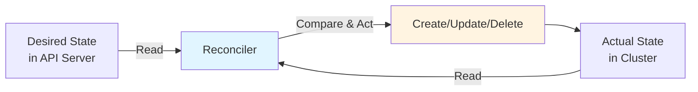
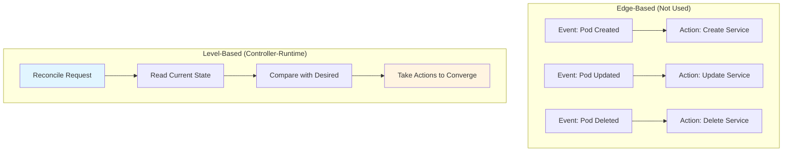
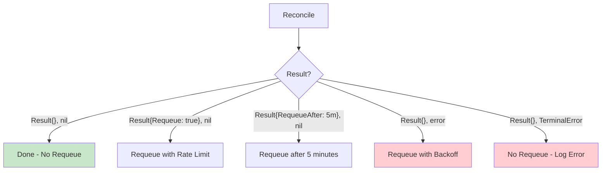
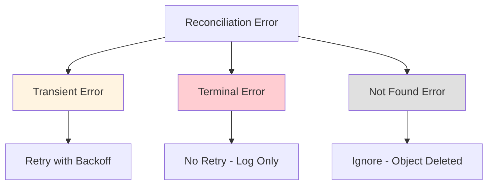

# Reconcile Package

## Overview

The `pkg/reconcile` package defines the core Reconciler interface and types that implement the business logic of Kubernetes controllers. Reconcilers are where you implement the actual control loop logic.

## Package Location

```
pkg/reconcile/
├── reconcile.go        # Reconciler interface and types
└── doc.go              # Package documentation
```

## Core Concepts

### Reconciliation Pattern

Reconciliation is the process of making the actual state of a system match the desired state:



### Level-Based vs Edge-Based

Controller-runtime uses **level-based** reconciliation:



**Benefits of Level-Based**:
- Resilient to missed events
- Self-healing
- Idempotent operations
- Easier to reason about

## Reconciler Interface

### Basic Reconciler

```go
type Reconciler interface {
    Reconcile(context.Context, Request) (Result, error)
}
```

### Typed Reconciler

```go
type TypedReconciler[request comparable] interface {
    Reconcile(context.Context, request) (Result, error)
}
```

The typed reconciler allows custom request types for advanced use cases.

## Request Type

The Request contains the minimal information needed to identify an object:

```go
type Request struct {
    types.NamespacedName
}

// NamespacedName contains:
// - Namespace string
// - Name string
```

**Important**: The Request does NOT contain:
- The actual object
- The event type (Create/Update/Delete)
- The old object state

This is intentional - reconcilers should read the current state from the API server.

## Result Type

The Result tells the controller what to do after reconciliation:

```go
type Result struct {
    // Requeue tells the controller to requeue with rate limiting
    // Deprecated: Use RequeueAfter instead
    Requeue bool

    // RequeueAfter requeues the request after the specified duration
    RequeueAfter time.Duration

    // Priority sets the priority for the requeued item
    // Only used with priority queues
    Priority *int
}
```

### Result Patterns



## Implementing a Reconciler

### Basic Structure

```go
import (
    "context"
    ctrl "sigs.k8s.io/controller-runtime"
    "sigs.k8s.io/controller-runtime/pkg/client"
    "sigs.k8s.io/controller-runtime/pkg/log"
)

type MyReconciler struct {
    client.Client
    Scheme *runtime.Scheme
}

func (r *MyReconciler) Reconcile(ctx context.Context, req ctrl.Request) (ctrl.Result, error) {
    log := log.FromContext(ctx)
    
    // 1. Fetch the resource
    var obj MyResource
    if err := r.Get(ctx, req.NamespacedName, &obj); err != nil {
        if errors.IsNotFound(err) {
            // Object not found, could have been deleted
            return ctrl.Result{}, nil
        }
        // Error reading the object
        return ctrl.Result{}, err
    }
    
    // 2. Handle deletion (finalizers)
    if !obj.DeletionTimestamp.IsZero() {
        return r.handleDeletion(ctx, &obj)
    }
    
    // 3. Reconcile logic
    if err := r.reconcileResource(ctx, &obj); err != nil {
        return ctrl.Result{}, err
    }
    
    // 4. Update status
    if err := r.Status().Update(ctx, &obj); err != nil {
        return ctrl.Result{}, err
    }
    
    return ctrl.Result{}, nil
}
```

## Reconciliation Patterns

### 1. Read-Compare-Act Pattern

```go
func (r *MyReconciler) Reconcile(ctx context.Context, req ctrl.Request) (ctrl.Result, error) {
    // Read current state
    var desired MyResource
    if err := r.Get(ctx, req.NamespacedName, &desired); err != nil {
        return ctrl.Result{}, client.IgnoreNotFound(err)
    }
    
    var actual corev1.Pod
    err := r.Get(ctx, types.NamespacedName{
        Name: desired.Name,
        Namespace: desired.Namespace,
    }, &actual)
    
    if errors.IsNotFound(err) {
        // Create the resource
        return ctrl.Result{}, r.createPod(ctx, &desired)
    } else if err != nil {
        return ctrl.Result{}, err
    }
    
    // Compare and update if needed
    if !reflect.DeepEqual(actual.Spec, desired.Spec) {
        actual.Spec = desired.Spec
        return ctrl.Result{}, r.Update(ctx, &actual)
    }
    
    return ctrl.Result{}, nil
}
```

### 2. Finalizer Pattern

```go
const myFinalizer = "myresource.example.com/finalizer"

func (r *MyReconciler) Reconcile(ctx context.Context, req ctrl.Request) (ctrl.Result, error) {
    var obj MyResource
    if err := r.Get(ctx, req.NamespacedName, &obj); err != nil {
        return ctrl.Result{}, client.IgnoreNotFound(err)
    }
    
    // Examine DeletionTimestamp to determine if object is under deletion
    if obj.DeletionTimestamp.IsZero() {
        // Object is not being deleted, add finalizer if not present
        if !controllerutil.ContainsFinalizer(&obj, myFinalizer) {
            controllerutil.AddFinalizer(&obj, myFinalizer)
            if err := r.Update(ctx, &obj); err != nil {
                return ctrl.Result{}, err
            }
        }
    } else {
        // Object is being deleted
        if controllerutil.ContainsFinalizer(&obj, myFinalizer) {
            // Perform cleanup
            if err := r.deleteExternalResources(ctx, &obj); err != nil {
                // If cleanup fails, return error to retry
                return ctrl.Result{}, err
            }
            
            // Remove finalizer to allow deletion
            controllerutil.RemoveFinalizer(&obj, myFinalizer)
            if err := r.Update(ctx, &obj); err != nil {
                return ctrl.Result{}, err
            }
        }
        
        // Stop reconciliation as the object is being deleted
        return ctrl.Result{}, nil
    }
    
    // Normal reconciliation logic
    return r.reconcileNormal(ctx, &obj)
}
```

### 3. Status Update Pattern

```go
func (r *MyReconciler) Reconcile(ctx context.Context, req ctrl.Request) (ctrl.Result, error) {
    var obj MyResource
    if err := r.Get(ctx, req.NamespacedName, &obj); err != nil {
        return ctrl.Result{}, client.IgnoreNotFound(err)
    }
    
    // Save original status
    originalStatus := obj.Status.DeepCopy()
    
    // Reconcile and update status fields
    if err := r.reconcile(ctx, &obj); err != nil {
        obj.Status.Conditions = append(obj.Status.Conditions, metav1.Condition{
            Type:    "Ready",
            Status:  metav1.ConditionFalse,
            Reason:  "ReconciliationFailed",
            Message: err.Error(),
        })
        // Update status even on error
        if statusErr := r.Status().Update(ctx, &obj); statusErr != nil {
            return ctrl.Result{}, utilerrors.NewAggregate([]error{err, statusErr})
        }
        return ctrl.Result{}, err
    }
    
    // Update status if changed
    if !reflect.DeepEqual(originalStatus, &obj.Status) {
        if err := r.Status().Update(ctx, &obj); err != nil {
            return ctrl.Result{}, err
        }
    }
    
    return ctrl.Result{}, nil
}
```

### 4. Periodic Reconciliation Pattern

```go
func (r *MyReconciler) Reconcile(ctx context.Context, req ctrl.Request) (ctrl.Result, error) {
    var obj MyResource
    if err := r.Get(ctx, req.NamespacedName, &obj); err != nil {
        return ctrl.Result{}, client.IgnoreNotFound(err)
    }
    
    // Perform reconciliation
    if err := r.reconcile(ctx, &obj); err != nil {
        return ctrl.Result{}, err
    }
    
    // Requeue after 5 minutes for periodic reconciliation
    return ctrl.Result{RequeueAfter: 5 * time.Minute}, nil
}
```

### 5. Conditional Requeue Pattern

```go
func (r *MyReconciler) Reconcile(ctx context.Context, req ctrl.Request) (ctrl.Result, error) {
    var obj MyResource
    if err := r.Get(ctx, req.NamespacedName, &obj); err != nil {
        return ctrl.Result{}, client.IgnoreNotFound(err)
    }
    
    // Check if resource is ready
    if !isReady(&obj) {
        // Not ready yet, check again in 30 seconds
        return ctrl.Result{RequeueAfter: 30 * time.Second}, nil
    }
    
    // Resource is ready, perform reconciliation
    return r.reconcile(ctx, &obj)
}
```

## Error Handling

### Error Types



### Handling Transient Errors

```go
func (r *MyReconciler) Reconcile(ctx context.Context, req ctrl.Request) (ctrl.Result, error) {
    // Transient error - will be retried with exponential backoff
    if err := r.doSomething(); err != nil {
        return ctrl.Result{}, err
    }
    
    return ctrl.Result{}, nil
}
```

### Handling Terminal Errors

```go
import "sigs.k8s.io/controller-runtime/pkg/reconcile"

func (r *MyReconciler) Reconcile(ctx context.Context, req ctrl.Request) (ctrl.Result, error) {
    var obj MyResource
    if err := r.Get(ctx, req.NamespacedName, &obj); err != nil {
        return ctrl.Result{}, client.IgnoreNotFound(err)
    }
    
    // Validate the resource
    if err := validate(&obj); err != nil {
        // Validation error - no point in retrying
        return ctrl.Result{}, reconcile.TerminalError(
            fmt.Errorf("validation failed: %w", err),
        )
    }
    
    return ctrl.Result{}, nil
}
```

### Handling Not Found Errors

```go
import (
    apierrors "k8s.io/apimachinery/pkg/api/errors"
    "sigs.k8s.io/controller-runtime/pkg/client"
)

func (r *MyReconciler) Reconcile(ctx context.Context, req ctrl.Request) (ctrl.Result, error) {
    var obj MyResource
    if err := r.Get(ctx, req.NamespacedName, &obj); err != nil {
        if apierrors.IsNotFound(err) {
            // Object not found, could have been deleted
            // Don't requeue
            return ctrl.Result{}, nil
        }
        // Other error
        return ctrl.Result{}, err
    }
    
    // Or use the helper
    if err := r.Get(ctx, req.NamespacedName, &obj); err != nil {
        return ctrl.Result{}, client.IgnoreNotFound(err)
    }
    
    return ctrl.Result{}, nil
}
```

## ObjectReconciler

For simpler use cases, you can use `ObjectReconciler` which receives the full object:

```go
type MyObjectReconciler struct {
    client.Client
}

func (r *MyObjectReconciler) Reconcile(ctx context.Context, obj *MyResource) (ctrl.Result, error) {
    // Object is already fetched and passed in
    // No need to Get it from the API server
    
    // Reconcile logic
    return ctrl.Result{}, nil
}

// Register with builder
err := ctrl.NewControllerManagedBy(mgr).
    For(&MyResource{}).
    Complete(reconcile.AsReconciler(mgr.GetClient(), &MyObjectReconciler{
        Client: mgr.GetClient(),
    }))
```

## Function Reconciler

You can use a function as a reconciler:

```go
reconcileFunc := func(ctx context.Context, req ctrl.Request) (ctrl.Result, error) {
    // Reconciliation logic
    return ctrl.Result{}, nil
}

err := ctrl.NewControllerManagedBy(mgr).
    For(&corev1.Pod{}).
    Complete(reconcile.Func(reconcileFunc))
```

## Best Practices

### 1. Always Handle Deletion

```go
if !obj.DeletionTimestamp.IsZero() {
    // Handle deletion with finalizers
    return r.handleDeletion(ctx, &obj)
}
```

### 2. Use client.IgnoreNotFound

```go
if err := r.Get(ctx, req.NamespacedName, &obj); err != nil {
    return ctrl.Result{}, client.IgnoreNotFound(err)
}
```

### 3. Update Status Separately

```go
// Update spec
if err := r.Update(ctx, &obj); err != nil {
    return ctrl.Result{}, err
}

// Update status
if err := r.Status().Update(ctx, &obj); err != nil {
    return ctrl.Result{}, err
}
```

### 4. Be Idempotent

```go
// Check if work is already done
if isAlreadyDone(&obj) {
    return ctrl.Result{}, nil
}

// Do work
if err := doWork(ctx, &obj); err != nil {
    return ctrl.Result{}, err
}
```

### 5. Use Appropriate Requeue Strategy

```go
// Success - no requeue
return ctrl.Result{}, nil

// Transient error - requeue with backoff
return ctrl.Result{}, err

// Wait for external condition - requeue after delay
return ctrl.Result{RequeueAfter: 30 * time.Second}, nil

// Permanent error - don't requeue
return ctrl.Result{}, reconcile.TerminalError(err)
```

### 6. Log Appropriately

```go
func (r *MyReconciler) Reconcile(ctx context.Context, req ctrl.Request) (ctrl.Result, error) {
    log := log.FromContext(ctx)
    
    log.Info("Starting reconciliation")
    
    // Reconciliation logic
    
    log.Info("Reconciliation complete")
    return ctrl.Result{}, nil
}
```

### 7. Handle Context Cancellation

```go
func (r *MyReconciler) Reconcile(ctx context.Context, req ctrl.Request) (ctrl.Result, error) {
    select {
    case <-ctx.Done():
        // Context cancelled, stop reconciliation
        return ctrl.Result{}, ctx.Err()
    default:
    }
    
    // Reconciliation logic
    return ctrl.Result{}, nil
}
```

## Common Pitfalls

### 1. Don't Store State in Reconciler

```go
// BAD - state is not preserved across reconciliations
type BadReconciler struct {
    client.Client
    counter int // This will be reset
}

// GOOD - read state from API server
type GoodReconciler struct {
    client.Client
}

func (r *GoodReconciler) Reconcile(ctx context.Context, req ctrl.Request) (ctrl.Result, error) {
    var obj MyResource
    if err := r.Get(ctx, req.NamespacedName, &obj); err != nil {
        return ctrl.Result{}, client.IgnoreNotFound(err)
    }
    
    // Use obj.Status.Counter instead
    obj.Status.Counter++
    return ctrl.Result{}, r.Status().Update(ctx, &obj)
}
```

### 2. Don't Rely on Event Order

```go
// BAD - assuming events come in order
func (r *BadReconciler) Reconcile(ctx context.Context, req ctrl.Request) (ctrl.Result, error) {
    // Don't assume this is a Create event
    return r.handleCreate(ctx, req)
}

// GOOD - read current state
func (r *GoodReconciler) Reconcile(ctx context.Context, req ctrl.Request) (ctrl.Result, error) {
    var obj MyResource
    if err := r.Get(ctx, req.NamespacedName, &obj); err != nil {
        return ctrl.Result{}, client.IgnoreNotFound(err)
    }
    
    // Reconcile based on current state
    return r.reconcile(ctx, &obj)
}
```

### 3. Don't Forget to Update Status

```go
// BAD - status not updated
func (r *BadReconciler) Reconcile(ctx context.Context, req ctrl.Request) (ctrl.Result, error) {
    var obj MyResource
    if err := r.Get(ctx, req.NamespacedName, &obj); err != nil {
        return ctrl.Result{}, client.IgnoreNotFound(err)
    }
    
    obj.Status.Ready = true
    // Missing: r.Status().Update(ctx, &obj)
    
    return ctrl.Result{}, nil
}

// GOOD - status updated
func (r *GoodReconciler) Reconcile(ctx context.Context, req ctrl.Request) (ctrl.Result, error) {
    var obj MyResource
    if err := r.Get(ctx, req.NamespacedName, &obj); err != nil {
        return ctrl.Result{}, client.IgnoreNotFound(err)
    }
    
    obj.Status.Ready = true
    if err := r.Status().Update(ctx, &obj); err != nil {
        return ctrl.Result{}, err
    }
    
    return ctrl.Result{}, nil
}
```

## Related Packages

- [Controller Package](./02-controller.md) - Invokes reconcilers
- [Builder Package](./04-builder.md) - Builds controllers with reconcilers
- [Client Package](./05-client.md) - Used by reconcilers to interact with API server
