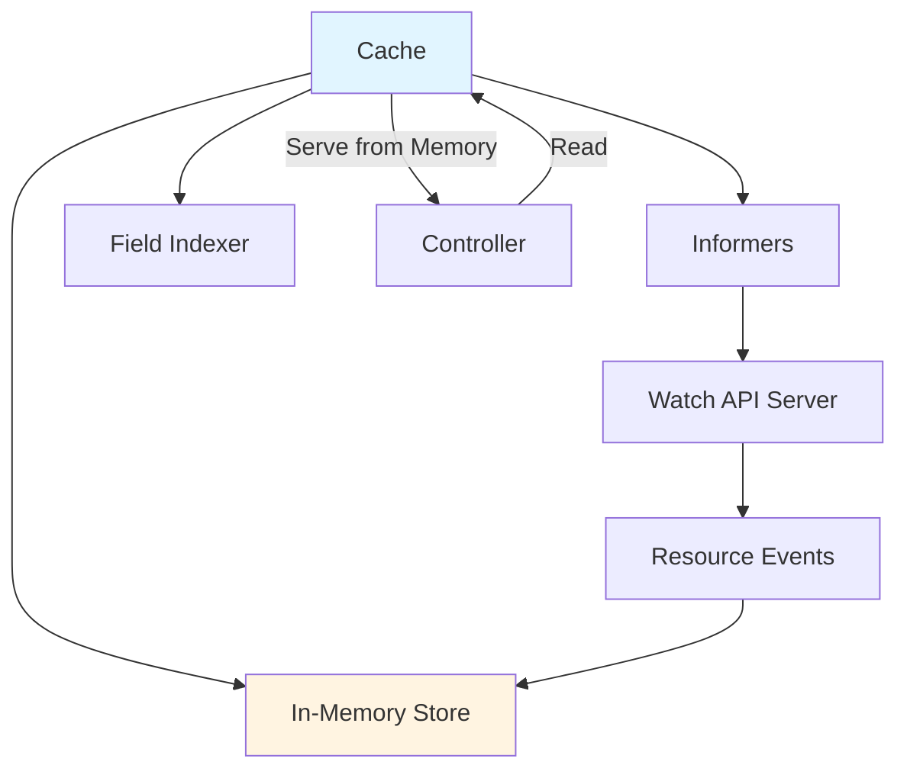
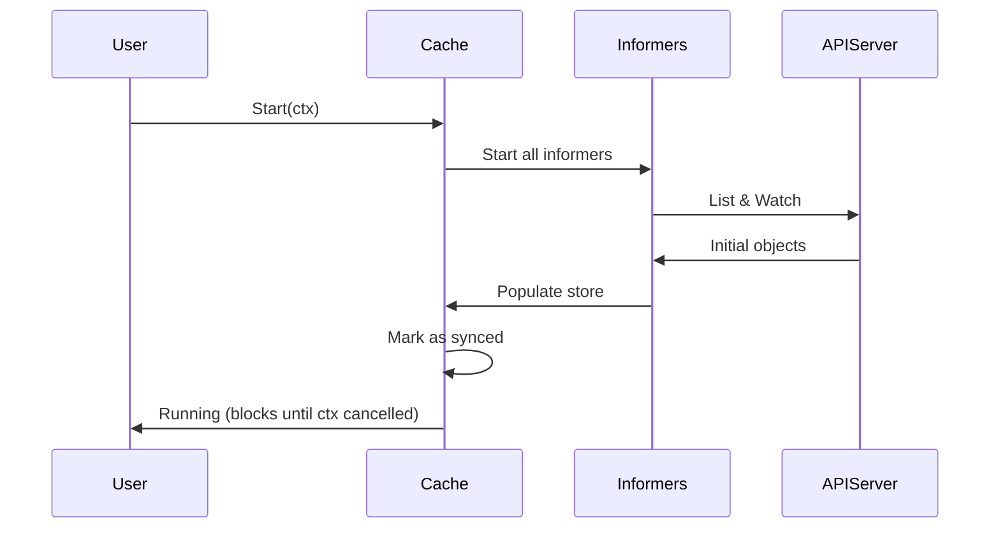

# Cache Package

## Overview

The `pkg/cache` package provides an in-memory cache of Kubernetes objects backed by informers. The cache reduces load on the API server and improves controller performance by serving read requests from local memory.

## Package Location

```
pkg/cache/
├── cache.go                # Cache interface and implementation
├── informer_cache.go       # Informer-based cache
├── multi_namespace_cache.go # Multi-namespace cache
├── delegating_by_gvk_cache.go # GVK-based cache delegation
└── internal/               # Internal implementation
```

## Core Concepts

### Cache Architecture



## Cache Interface

The Cache interface combines Reader and Informers:

```go
type Cache interface {
    // Reader interface for reading objects
    client.Reader
    
    // Informers interface for managing informers
    Informers
}

type Informers interface {
    // GetInformer fetches or constructs an informer
    GetInformer(ctx context.Context, obj client.Object, opts ...InformerGetOption) (Informer, error)
    
    // GetInformerForKind fetches an informer by GVK
    GetInformerForKind(ctx context.Context, gvk schema.GroupVersionKind, opts ...InformerGetOption) (Informer, error)
    
    // RemoveInformer removes and stops an informer
    RemoveInformer(ctx context.Context, obj client.Object) error
    
    // Start runs all informers
    Start(ctx context.Context) error
    
    // WaitForCacheSync waits for all caches to sync
    WaitForCacheSync(ctx context.Context) bool
    
    // FieldIndexer for adding field indexes
    client.FieldIndexer
}
```

## Creating a Cache

### Basic Cache Creation

```go
import (
    "sigs.k8s.io/controller-runtime/pkg/cache"
    "sigs.k8s.io/controller-runtime/pkg/client/config"
)

// Create a cache
c, err := cache.New(config.GetConfigOrDie(), cache.Options{
    Scheme: scheme,
})

// Start the cache
go func() {
    if err := c.Start(ctx); err != nil {
        // Handle error
    }
}()

// Wait for cache to sync
if !c.WaitForCacheSync(ctx) {
    // Cache didn't sync
}
```

### Cache from Manager

The manager automatically creates and manages a cache:

```go
mgr, err := ctrl.NewManager(cfg, ctrl.Options{
    Cache: cache.Options{
        // Cache configuration
    },
})

// Get the cache
cache := mgr.GetCache()
```

## Cache Options

### Namespace Filtering

```go
// Watch specific namespaces
cache.Options{
    DefaultNamespaces: map[string]cache.Config{
        "namespace1": {},
        "namespace2": {},
    },
}

// Watch all namespaces (default)
cache.Options{
    // No DefaultNamespaces specified
}
```

### Label and Field Selectors

```go
// Global label selector for all resources
cache.Options{
    DefaultLabelSelector: labels.SelectorFromSet(labels.Set{
        "managed-by": "my-controller",
    }),
}

// Per-resource selectors
cache.Options{
    ByObject: map[client.Object]cache.ByObject{
        &corev1.Pod{}: {
            Label: labels.SelectorFromSet(labels.Set{"app": "myapp"}),
            Field: fields.SelectorFromSet(fields.Set{"spec.nodeName": "node-1"}),
        },
    },
}
```

### Transform Functions

Reduce memory usage by transforming objects before caching:

```go
cache.Options{
    DefaultTransform: func(obj interface{}) (interface{}, error) {
        // Remove unnecessary fields
        if pod, ok := obj.(*corev1.Pod); ok {
            pod.ManagedFields = nil
            pod.Annotations = nil
        }
        return obj, nil
    },
}

// Per-resource transforms
cache.Options{
    ByObject: map[client.Object]cache.ByObject{
        &corev1.Pod{}: {
            Transform: func(obj interface{}) (interface{}, error) {
                // Custom transform for Pods
                return obj, nil
            },
        },
    },
}
```

### Sync Period

```go
// Set sync period (default: 10 hours)
cache.Options{
    SyncPeriod: ptr.To(5 * time.Minute),
}
```

### Namespace-Specific Configuration

```go
cache.Options{
    DefaultNamespaces: map[string]cache.Config{
        "namespace1": {
            LabelSelector: labels.SelectorFromSet(labels.Set{"env": "prod"}),
            FieldSelector: fields.SelectorFromSet(fields.Set{"status.phase": "Running"}),
        },
        "namespace2": {
            LabelSelector: labels.SelectorFromSet(labels.Set{"env": "dev"}),
        },
    },
}
```

## Reading from Cache

### Get Operation

```go
// Get a Pod from cache
var pod corev1.Pod
err := cache.Get(ctx, types.NamespacedName{
    Name:      "my-pod",
    Namespace: "default",
}, &pod)
```

### List Operation

```go
// List all Pods from cache
var podList corev1.PodList
err := cache.List(ctx, &podList, &client.ListOptions{
    Namespace: "default",
})

// List with label selector
err = cache.List(ctx, &podList,
    client.InNamespace("default"),
    client.MatchingLabels{"app": "myapp"})

// List with field selector (requires index)
err = cache.List(ctx, &podList,
    client.MatchingFields{"spec.nodeName": "node-1"})
```

## Field Indexing

Field indexes enable efficient lookups by field values:

### Adding an Index

```go
// Index Pods by node name
err := cache.IndexField(ctx, &corev1.Pod{}, "spec.nodeName",
    func(obj client.Object) []string {
        pod := obj.(*corev1.Pod)
        if pod.Spec.NodeName == "" {
            return nil
        }
        return []string{pod.Spec.NodeName}
    })

// Index Pods by owner reference
err = cache.IndexField(ctx, &corev1.Pod{}, "owner",
    func(obj client.Object) []string {
        pod := obj.(*corev1.Pod)
        var owners []string
        for _, ref := range pod.OwnerReferences {
            owners = append(owners, string(ref.UID))
        }
        return owners
    })
```

### Using an Index

```go
// List Pods on a specific node using the index
var podList corev1.PodList
err := cache.List(ctx, &podList,
    client.MatchingFields{"spec.nodeName": "node-1"})

// List Pods owned by a specific object
err = cache.List(ctx, &podList,
    client.MatchingFields{"owner": string(owner.UID)})
```

### Common Indexes

```go
// Index by owner reference
cache.IndexField(ctx, &corev1.Pod{}, ".metadata.ownerReferences.uid",
    func(obj client.Object) []string {
        pod := obj.(*corev1.Pod)
        var uids []string
        for _, ref := range pod.OwnerReferences {
            uids = append(uids, string(ref.UID))
        }
        return uids
    })

// Index by label
cache.IndexField(ctx, &corev1.Pod{}, ".metadata.labels.app",
    func(obj client.Object) []string {
        pod := obj.(*corev1.Pod)
        if app, ok := pod.Labels["app"]; ok {
            return []string{app}
        }
        return nil
    })

// Index by status field
cache.IndexField(ctx, &corev1.Pod{}, ".status.phase",
    func(obj client.Object) []string {
        pod := obj.(*corev1.Pod)
        return []string{string(pod.Status.Phase)}
    })
```

## Informers

### Getting an Informer

```go
// Get informer for a resource type
informer, err := cache.GetInformer(ctx, &corev1.Pod{})

// Get informer by GVK
gvk := schema.GroupVersionKind{
    Group:   "",
    Version: "v1",
    Kind:    "Pod",
}
informer, err = cache.GetInformerForKind(ctx, gvk)
```

### Using Informers

```go
// Add event handler to informer
registration, err := informer.AddEventHandler(toolscache.ResourceEventHandlerFuncs{
    AddFunc: func(obj interface{}) {
        // Handle add
    },
    UpdateFunc: func(oldObj, newObj interface{}) {
        // Handle update
    },
    DeleteFunc: func(obj interface{}) {
        // Handle delete
    },
})

// Remove event handler
err = informer.RemoveEventHandler(registration)
```

### Informer Options

```go
// Block until informer is synced
informer, err := cache.GetInformer(ctx, &corev1.Pod{},
    cache.BlockUntilSynced(true))
```

## Cache Lifecycle

### Starting the Cache



### Waiting for Sync

```go
// Start cache
go func() {
    if err := cache.Start(ctx); err != nil {
        log.Error(err, "cache start failed")
    }
}()

// Wait for cache to sync (with timeout)
syncCtx, cancel := context.WithTimeout(ctx, 2*time.Minute)
defer cancel()

if !cache.WaitForCacheSync(syncCtx) {
    log.Error(nil, "cache sync timeout")
}
```

## Multi-Namespace Cache

For watching specific namespaces:

```go
cache.Options{
    DefaultNamespaces: map[string]cache.Config{
        "namespace1": {},
        "namespace2": {},
        "namespace3": {},
    },
}
```

### All Namespaces

```go
// Watch all namespaces
cache.Options{
    DefaultNamespaces: map[string]cache.Config{
        cache.AllNamespaces: {},
    },
}

// Or simply don't specify DefaultNamespaces
```

## Cache Patterns

### 1. Namespace-Scoped Cache

```go
mgr, err := ctrl.NewManager(cfg, ctrl.Options{
    Cache: cache.Options{
        DefaultNamespaces: map[string]cache.Config{
            "my-namespace": {},
        },
    },
})
```

### 2. Label-Filtered Cache

```go
mgr, err := ctrl.NewManager(cfg, ctrl.Options{
    Cache: cache.Options{
        DefaultLabelSelector: labels.SelectorFromSet(labels.Set{
            "managed-by": "my-controller",
        }),
    },
})
```

### 3. Resource-Specific Configuration

```go
mgr, err := ctrl.NewManager(cfg, ctrl.Options{
    Cache: cache.Options{
        ByObject: map[client.Object]cache.ByObject{
            &corev1.Pod{}: {
                Label: labels.SelectorFromSet(labels.Set{"app": "myapp"}),
                Namespaces: map[string]cache.Config{
                    "namespace1": {},
                    "namespace2": {},
                },
            },
            &corev1.ConfigMap{}: {
                Transform: func(obj interface{}) (interface{}, error) {
                    // Remove data to save memory
                    if cm, ok := obj.(*corev1.ConfigMap); ok {
                        cm.Data = nil
                        cm.BinaryData = nil
                    }
                    return obj, nil
                },
            },
        },
    },
})
```

### 4. Memory-Optimized Cache

```go
mgr, err := ctrl.NewManager(cfg, ctrl.Options{
    Cache: cache.Options{
        DefaultTransform: func(obj interface{}) (interface{}, error) {
            // Remove unnecessary fields to reduce memory
            if accessor, err := meta.Accessor(obj); err == nil {
                accessor.SetManagedFields(nil)
                // Remove other unnecessary fields
            }
            return obj, nil
        },
    },
})
```

## Cache Consistency

### Read-After-Write Consistency

The cache does NOT guarantee read-after-write consistency:

```go
// Create a Pod
err := client.Create(ctx, &pod)

// This Get might not see the pod immediately!
err = client.Get(ctx, key, &pod)
```

**Solution**: Use the API reader for immediate consistency:

```go
// Create a Pod
err := client.Create(ctx, &pod)

// Read directly from API server
apiReader := mgr.GetAPIReader()
err = apiReader.Get(ctx, key, &pod) // Guaranteed to see the pod
```

### Cache Invalidation

The cache is eventually consistent with the API server:

- Updates from API server are reflected via watch events
- Periodic re-sync ensures consistency (default: 10 hours)
- No manual invalidation needed

## Best Practices

### 1. Use Namespace Filtering

Reduce memory usage by watching only needed namespaces:

```go
cache.Options{
    DefaultNamespaces: map[string]cache.Config{
        "my-namespace": {},
    },
}
```

### 2. Use Label Selectors

Filter objects at the cache level:

```go
cache.Options{
    DefaultLabelSelector: labels.SelectorFromSet(labels.Set{
        "managed-by": "my-controller",
    }),
}
```

### 3. Add Indexes for Frequent Lookups

```go
// Add index for efficient lookups
cache.IndexField(ctx, &corev1.Pod{}, "spec.nodeName", indexFunc)

// Use the index
cache.List(ctx, &podList, client.MatchingFields{"spec.nodeName": "node-1"})
```

### 4. Use Transform Functions

Reduce memory for large objects:

```go
cache.Options{
    DefaultTransform: func(obj interface{}) (interface{}, error) {
        // Remove unnecessary fields
        return obj, nil
    },
}
```

### 5. Wait for Cache Sync

Always wait for cache sync before using:

```go
if !cache.WaitForCacheSync(ctx) {
    return fmt.Errorf("cache sync failed")
}
```

### 6. Use API Reader for Critical Reads

When you need the latest data:

```go
// Use API reader instead of cache
apiReader := mgr.GetAPIReader()
err := apiReader.Get(ctx, key, &obj)
```

## Common Pitfalls

### 1. Not Waiting for Cache Sync

```go
// BAD - reading before cache is synced
cache.Start(ctx)
cache.Get(ctx, key, &obj) // May fail or return stale data

// GOOD - wait for sync
cache.Start(ctx)
cache.WaitForCacheSync(ctx)
cache.Get(ctx, key, &obj)
```

### 2. Expecting Immediate Consistency

```go
// BAD - expecting immediate consistency
client.Create(ctx, &obj)
client.Get(ctx, key, &obj) // May not see the object

// GOOD - use API reader
client.Create(ctx, &obj)
apiReader.Get(ctx, key, &obj) // Guaranteed to see it
```

### 3. Not Using Indexes

```go
// BAD - inefficient without index
cache.List(ctx, &podList)
for _, pod := range podList.Items {
    if pod.Spec.NodeName == "node-1" {
        // Process pod
    }
}

// GOOD - use index
cache.IndexField(ctx, &corev1.Pod{}, "spec.nodeName", indexFunc)
cache.List(ctx, &podList, client.MatchingFields{"spec.nodeName": "node-1"})
```

## Performance Considerations

### Memory Usage

- Each cached object consumes memory
- Use namespace filtering to reduce objects
- Use label selectors to filter objects
- Use transform functions to remove unnecessary fields
- Consider metadata-only watches for large objects

### CPU Usage

- Informers use CPU for processing watch events
- More informers = more CPU usage
- Sync period affects CPU (shorter = more CPU)

### Network Usage

- Initial list operation can be large
- Watch events are incremental
- Sync period affects network usage

## Related Packages

- [Client Package](./05-client.md) - Uses cache for reads
- [Manager Package](./01-manager.md) - Creates and manages cache
- [Controller Package](./02-controller.md) - Uses cache via sources
