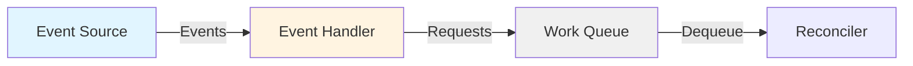
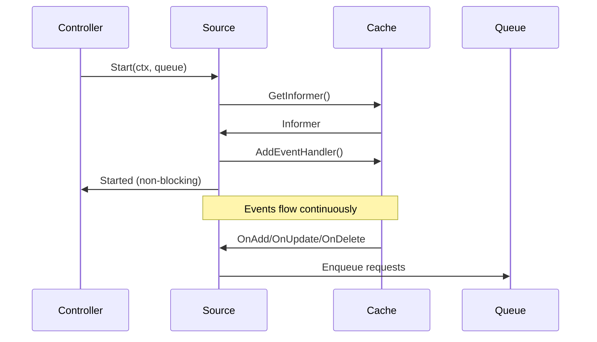
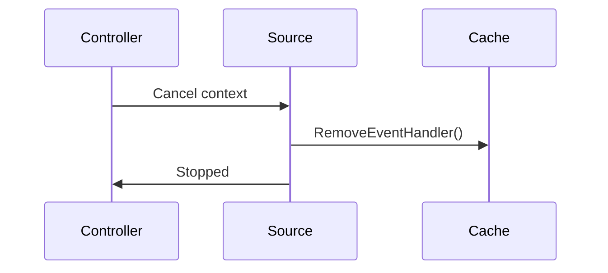

# Source Package

## Overview

The `pkg/source` package provides event sources that feed events into controllers. Sources watch for changes and generate events that are processed by handlers to enqueue reconcile requests.

## Package Location

```
pkg/source/
├── source.go           # Source interfaces and implementations
├── doc.go              # Package documentation
└── example_test.go     # Usage examples
```

## Core Concepts

### Source Flow



## Source Interface

```go
type Source = TypedSource[reconcile.Request]

type TypedSource[request comparable] interface {
    // Start is called by the Controller to start the source
    // Must be non-blocking
    Start(context.Context, workqueue.TypedRateLimitingInterface[request]) error
}
```

### SyncingSource

Sources that need synchronization implement this interface:

```go
type SyncingSource = TypedSyncingSource[reconcile.Request]

type TypedSyncingSource[request comparable] interface {
    TypedSource[request]
    // WaitForSync waits for the source to sync
    WaitForSync(ctx context.Context) error
}
```

## Built-in Sources

### Kind Source

The most common source - watches Kubernetes resources:

```go
import (
    "sigs.k8s.io/controller-runtime/pkg/source"
    "sigs.k8s.io/controller-runtime/pkg/handler"
)

// Watch Pods
source.Kind(
    mgr.GetCache(),
    &corev1.Pod{},
    &handler.EnqueueRequestForObject{},
)

// With predicates
source.Kind(
    mgr.GetCache(),
    &corev1.Pod{},
    &handler.EnqueueRequestForObject{},
    predicate.GenerationChangedPredicate{},
)
```

### Channel Source

For events from external sources:

```go
// Create a channel
events := make(chan event.GenericEvent)

// Create source
src := source.Channel(
    events,
    &handler.EnqueueRequestForObject{},
)

// Send events
events <- event.GenericEvent{
    Object: &corev1.Pod{
        ObjectMeta: metav1.ObjectMeta{
            Name:      "my-pod",
            Namespace: "default",
        },
    },
}
```

## Using Sources with Builder

### For Method (Primary Resource)

```go
// Automatically creates a Kind source
ctrl.NewControllerManagedBy(mgr).
    For(&corev1.Pod{})
```

Equivalent to:

```go
ctrl.NewControllerManagedBy(mgr).
    WatchesRawSource(
        source.Kind(mgr.GetCache(), &corev1.Pod{},
            &handler.EnqueueRequestForObject{}),
    )
```

### Owns Method (Owned Resources)

```go
// Automatically creates a Kind source with owner handler
ctrl.NewControllerManagedBy(mgr).
    For(&appsv1.Deployment{}).
    Owns(&corev1.Pod{})
```

Equivalent to:

```go
ctrl.NewControllerManagedBy(mgr).
    For(&appsv1.Deployment{}).
    WatchesRawSource(
        source.Kind(mgr.GetCache(), &corev1.Pod{},
            handler.EnqueueRequestForOwner(
                mgr.GetScheme(),
                mgr.GetRESTMapper(),
                &appsv1.Deployment{},
                handler.OnlyControllerOwner(),
            )),
    )
```

### Watches Method (Custom Sources)

```go
// Watch ConfigMaps with custom mapping
ctrl.NewControllerManagedBy(mgr).
    For(&appsv1.Deployment{}).
    Watches(
        &corev1.ConfigMap{},
        handler.EnqueueRequestsFromMapFunc(func(ctx context.Context, obj client.Object) []reconcile.Request {
            // Map ConfigMap to Deployments
            return []reconcile.Request{
                {NamespacedName: types.NamespacedName{
                    Name:      obj.GetName() + "-deployment",
                    Namespace: obj.GetNamespace(),
                }},
            }
        }),
    )
```

### WatchesRawSource Method

For complete control:

```go
ctrl.NewControllerManagedBy(mgr).
    For(&appsv1.Deployment{}).
    WatchesRawSource(
        source.Kind(mgr.GetCache(), &corev1.Pod{},
            &handler.EnqueueRequestForObject{},
            predicate.GenerationChangedPredicate{}),
    )
```

## Kind Source Details

### Basic Kind Source

```go
src := source.Kind(
    cache,              // Cache to watch
    &corev1.Pod{},      // Object type
    handler,            // Event handler
    predicates...,      // Optional predicates
)
```

### Kind Source with Predicates

```go
src := source.Kind(
    mgr.GetCache(),
    &corev1.Pod{},
    &handler.EnqueueRequestForObject{},
    predicate.Funcs{
        CreateFunc: func(e event.CreateEvent) bool {
            return e.Object.GetNamespace() == "production"
        },
        UpdateFunc: func(e event.UpdateEvent) bool {
            return e.ObjectNew.GetGeneration() != e.ObjectOld.GetGeneration()
        },
    },
)
```

### Typed Kind Source

For custom request types:

```go
type CustomRequest struct {
    NamespacedName types.NamespacedName
    Priority       int
}

src := source.TypedKind[*corev1.Pod, CustomRequest](
    mgr.GetCache(),
    &corev1.Pod{},
    customHandler,
    predicates...,
)
```

## Channel Source Details

### Basic Channel Source

```go
// Create channel
events := make(chan event.GenericEvent, 10)

// Create source
src := source.Channel(
    events,
    &handler.EnqueueRequestForObject{},
)

// Add to controller
err := c.Watch(src)

// Send events
go func() {
    ticker := time.NewTicker(5 * time.Minute)
    defer ticker.Stop()
    
    for {
        select {
        case <-ticker.C:
            events <- event.GenericEvent{
                Object: &myv1.MyResource{
                    ObjectMeta: metav1.ObjectMeta{
                        Name:      "periodic-check",
                        Namespace: "default",
                    },
                },
            }
        case <-ctx.Done():
            return
        }
    }
}()
```

### Channel Source with Predicates

```go
src := source.Channel(
    events,
    &handler.EnqueueRequestForObject{},
    predicate.Funcs{
        GenericFunc: func(e event.GenericEvent) bool {
            // Filter events
            return e.Object.GetLabels()["trigger"] == "true"
        },
    },
)
```

## Common Source Patterns

### 1. Watch Primary Resource

```go
// Watch the resource being reconciled
ctrl.NewControllerManagedBy(mgr).
    For(&myv1.MyResource{})
```

### 2. Watch Owned Resources

```go
// Watch resources created by the controller
ctrl.NewControllerManagedBy(mgr).
    For(&myv1.MyResource{}).
    Owns(&corev1.Pod{}).
    Owns(&corev1.Service{})
```

### 3. Watch Related Resources

```go
// Watch resources that affect reconciliation
ctrl.NewControllerManagedBy(mgr).
    For(&myv1.MyResource{}).
    Watches(
        &corev1.ConfigMap{},
        handler.EnqueueRequestsFromMapFunc(mapConfigMapToMyResource),
    )
```

### 4. Periodic Reconciliation

```go
// Trigger reconciliation periodically
events := make(chan event.GenericEvent)

go func() {
    ticker := time.NewTicker(5 * time.Minute)
    defer ticker.Stop()
    
    for {
        select {
        case <-ticker.C:
            // List all resources and trigger reconciliation
            var list myv1.MyResourceList
            if err := mgr.GetClient().List(ctx, &list); err == nil {
                for _, item := range list.Items {
                    events <- event.GenericEvent{Object: &item}
                }
            }
        case <-ctx.Done():
            return
        }
    }
}()

ctrl.NewControllerManagedBy(mgr).
    For(&myv1.MyResource{}).
    WatchesRawSource(
        source.Channel(events, &handler.EnqueueRequestForObject{}),
    )
```

### 5. External Event Source

```go
// Watch external events (e.g., GitHub webhooks)
events := make(chan event.GenericEvent, 100)

// HTTP handler for webhooks
http.HandleFunc("/webhook", func(w http.ResponseWriter, r *http.Request) {
    // Parse webhook payload
    // Create event
    events <- event.GenericEvent{
        Object: &myv1.MyResource{
            ObjectMeta: metav1.ObjectMeta{
                Name:      "resource-name",
                Namespace: "default",
            },
        },
    }
})

ctrl.NewControllerManagedBy(mgr).
    For(&myv1.MyResource{}).
    WatchesRawSource(
        source.Channel(events, &handler.EnqueueRequestForObject{}),
    )
```

### 6. Cross-Namespace Watching

```go
// Watch resources in multiple namespaces
ctrl.NewControllerManagedBy(mgr).
    For(&myv1.MyResource{}).
    Watches(
        &corev1.Secret{},
        handler.EnqueueRequestsFromMapFunc(func(ctx context.Context, obj client.Object) []reconcile.Request {
            // Map Secret to MyResources across namespaces
            var resources myv1.MyResourceList
            if err := mgr.GetClient().List(ctx, &resources); err != nil {
                return nil
            }
            
            var requests []reconcile.Request
            for _, res := range resources.Items {
                if res.Spec.SecretRef == obj.GetName() {
                    requests = append(requests, reconcile.Request{
                        NamespacedName: types.NamespacedName{
                            Name:      res.Name,
                            Namespace: res.Namespace,
                        },
                    })
                }
            }
            return requests
        }),
    )
```

## Source Lifecycle

### Source Startup



### Source Shutdown



## Custom Sources

### Implementing a Custom Source

```go
type MySource struct {
    handler handler.EventHandler
}

func (s *MySource) Start(ctx context.Context, queue workqueue.RateLimitingInterface) error {
    // Start watching for events
    go func() {
        ticker := time.NewTicker(1 * time.Minute)
        defer ticker.Stop()
        
        for {
            select {
            case <-ticker.C:
                // Generate event
                evt := event.GenericEvent{
                    Object: &corev1.Pod{
                        ObjectMeta: metav1.ObjectMeta{
                            Name:      "my-pod",
                            Namespace: "default",
                        },
                    },
                }
                // Process with handler
                s.handler.Generic(ctx, evt, queue)
            case <-ctx.Done():
                return
            }
        }
    }()
    
    return nil
}

// Use custom source
src := &MySource{handler: &handler.EnqueueRequestForObject{}}
err := c.Watch(src)
```

### Custom SyncingSource

```go
type MySyncingSource struct {
    MySource
    synced chan struct{}
}

func (s *MySyncingSource) Start(ctx context.Context, queue workqueue.RateLimitingInterface) error {
    // Start source
    if err := s.MySource.Start(ctx, queue); err != nil {
        return err
    }
    
    // Mark as synced after initial sync
    go func() {
        // Wait for initial sync
        time.Sleep(1 * time.Second)
        close(s.synced)
    }()
    
    return nil
}

func (s *MySyncingSource) WaitForSync(ctx context.Context) error {
    select {
    case <-s.synced:
        return nil
    case <-ctx.Done():
        return ctx.Err()
    }
}
```

## Best Practices

### 1. Use Kind Source for Kubernetes Resources

```go
// Preferred
ctrl.NewControllerManagedBy(mgr).
    For(&corev1.Pod{})

// Instead of custom source
```

### 2. Use Channel Source for External Events

```go
// For webhooks, timers, external systems
events := make(chan event.GenericEvent)
source.Channel(events, handler)
```

### 3. Add Predicates to Filter Events

```go
source.Kind(
    cache,
    &corev1.Pod{},
    handler,
    predicate.GenerationChangedPredicate{},
)
```

### 4. Buffer Channel Sources

```go
// Buffer to avoid blocking
events := make(chan event.GenericEvent, 100)
```

### 5. Handle Context Cancellation

```go
go func() {
    for {
        select {
        case <-ticker.C:
            events <- evt
        case <-ctx.Done():
            return
        }
    }
}()
```

## Common Pitfalls

### 1. Blocking in Start Method

```go
// BAD - Start must not block
func (s *MySource) Start(ctx context.Context, queue workqueue.RateLimitingInterface) error {
    for {
        // This blocks!
        events <- evt
    }
}

// GOOD - Start in goroutine
func (s *MySource) Start(ctx context.Context, queue workqueue.RateLimitingInterface) error {
    go func() {
        for {
            select {
            case <-ticker.C:
                events <- evt
            case <-ctx.Done():
                return
            }
        }
    }()
    return nil
}
```

### 2. Not Handling Context Cancellation

```go
// BAD - goroutine leak
go func() {
    for {
        events <- evt
    }
}()

// GOOD - respect context
go func() {
    for {
        select {
        case <-ctx.Done():
            return
        default:
            events <- evt
        }
    }
}()
```

### 3. Unbuffered Channels

```go
// BAD - can block
events := make(chan event.GenericEvent)

// GOOD - buffered
events := make(chan event.GenericEvent, 100)
```

## Related Packages

- [Handler Package](./08-handler.md) - Processes events from sources
- [Predicate Package](./09-predicate.md) - Filters events from sources
- [Controller Package](./02-controller.md) - Uses sources
- [Builder Package](./04-builder.md) - Configures sources
