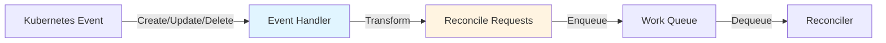

# Handler Package

## Overview

The `pkg/handler` package provides event handlers that transform Kubernetes events into reconcile requests. Handlers determine which objects should be reconciled in response to an event.

## Package Location

```
pkg/handler/
├── eventhandler.go         # Handler interfaces
├── enqueue.go              # EnqueueRequestForObject
├── enqueue_owner.go        # EnqueueRequestForOwner
├── enqueue_mapped.go       # EnqueueRequestsFromMapFunc
├── doc.go                  # Package documentation
└── example_test.go         # Usage examples
```

## Core Concepts

### Handler Flow



## EventHandler Interface

```go
type EventHandler = TypedEventHandler[client.Object, reconcile.Request]

type TypedEventHandler[object any, request comparable] interface {
    // Create is called in response to a create event
    Create(context.Context, event.TypedCreateEvent[object], workqueue.TypedRateLimitingInterface[request])
    
    // Update is called in response to an update event
    Update(context.Context, event.TypedUpdateEvent[object], workqueue.TypedRateLimitingInterface[request])
    
    // Delete is called in response to a delete event
    Delete(context.Context, event.TypedDeleteEvent[object], workqueue.TypedRateLimitingInterface[request])
    
    // Generic is called for synthetic events
    Generic(context.Context, event.TypedGenericEvent[object], workqueue.TypedRateLimitingInterface[request])
}
```

## Built-in Handlers

### 1. EnqueueRequestForObject

Enqueues the object that triggered the event:

```go
import "sigs.k8s.io/controller-runtime/pkg/handler"

// Enqueue the Pod itself
handler := &handler.EnqueueRequestForObject{}

// Use with builder
ctrl.NewControllerManagedBy(mgr).
    For(&corev1.Pod{}) // Automatically uses EnqueueRequestForObject
```

**Use case**: Reconcile the object that changed.

**Example**:
- Pod created → Reconcile that Pod
- Deployment updated → Reconcile that Deployment

### 2. EnqueueRequestForOwner

Enqueues the owner of the object:

```go
// Enqueue the Deployment that owns the Pod
handler := handler.EnqueueRequestForOwner(
    mgr.GetScheme(),
    mgr.GetRESTMapper(),
    &appsv1.Deployment{}, // Owner type
    handler.OnlyControllerOwner(), // Only controller owner
)

// Use with builder
ctrl.NewControllerManagedBy(mgr).
    For(&appsv1.Deployment{}).
    Owns(&corev1.Pod{}) // Automatically uses EnqueueRequestForOwner
```

**Use case**: Reconcile the owner when owned resource changes.

**Example**:
- Pod created → Reconcile owning Deployment
- ReplicaSet updated → Reconcile owning Deployment

### 3. EnqueueRequestsFromMapFunc

Custom mapping from event to reconcile requests:

```go
// Map ConfigMap to Deployments that reference it
handler := handler.EnqueueRequestsFromMapFunc(
    func(ctx context.Context, obj client.Object) []reconcile.Request {
        // Find Deployments that reference this ConfigMap
        var deployments appsv1.DeploymentList
        if err := mgr.GetClient().List(ctx, &deployments); err != nil {
            return nil
        }
        
        var requests []reconcile.Request
        for _, deploy := range deployments.Items {
            // Check if deployment references this ConfigMap
            for _, vol := range deploy.Spec.Template.Spec.Volumes {
                if vol.ConfigMap != nil && vol.ConfigMap.Name == obj.GetName() {
                    requests = append(requests, reconcile.Request{
                        NamespacedName: types.NamespacedName{
                            Name:      deploy.Name,
                            Namespace: deploy.Namespace,
                        },
                    })
                }
            }
        }
        return requests
    },
)

// Use with builder
ctrl.NewControllerManagedBy(mgr).
    For(&appsv1.Deployment{}).
    Watches(&corev1.ConfigMap{}, handler)
```

**Use case**: Custom mapping logic between resources.

**Example**:
- ConfigMap updated → Reconcile all Deployments using it
- Node updated → Reconcile all Pods on that Node
- Secret changed → Reconcile all resources referencing it

## Handler Usage Patterns

### Pattern 1: Watch Primary Resource

```go
// Automatically uses EnqueueRequestForObject
ctrl.NewControllerManagedBy(mgr).
    For(&myv1.MyResource{})
```

Equivalent to:

```go
ctrl.NewControllerManagedBy(mgr).
    WatchesRawSource(
        source.Kind(mgr.GetCache(), &myv1.MyResource{},
            &handler.EnqueueRequestForObject{}),
    )
```

### Pattern 2: Watch Owned Resources

```go
// Automatically uses EnqueueRequestForOwner
ctrl.NewControllerManagedBy(mgr).
    For(&appsv1.Deployment{}).
    Owns(&corev1.Pod{})
```

Equivalent to:

```go
ctrl.NewControllerManagedBy(mgr).
    For(&appsv1.Deployment{}).
    WatchesRawSource(
        source.Kind(mgr.GetCache(), &corev1.Pod{},
            handler.EnqueueRequestForOwner(
                mgr.GetScheme(),
                mgr.GetRESTMapper(),
                &appsv1.Deployment{},
                handler.OnlyControllerOwner(),
            )),
    )
```

### Pattern 3: Custom Mapping

```go
ctrl.NewControllerManagedBy(mgr).
    For(&myv1.MyResource{}).
    Watches(
        &corev1.ConfigMap{},
        handler.EnqueueRequestsFromMapFunc(mapFunc),
    )
```

## EnqueueRequestForOwner Details

### Controller Owner Only

```go
// Only enqueue if owner reference has controller=true
handler.EnqueueRequestForOwner(
    scheme,
    mapper,
    &appsv1.Deployment{},
    handler.OnlyControllerOwner(), // Default behavior
)
```

### All Owners

```go
// Enqueue for all owner references
handler.EnqueueRequestForOwner(
    scheme,
    mapper,
    &appsv1.Deployment{},
    // No OnlyControllerOwner option
)

// Or with builder
ctrl.NewControllerManagedBy(mgr).
    For(&appsv1.Deployment{}).
    Owns(&corev1.Pod{}, builder.MatchEveryOwner)
```

### Typed Owner Handler

```go
// Type-safe owner handler
handler := handler.TypedEnqueueRequestForOwner[*corev1.Pod](
    mgr.GetScheme(),
    mgr.GetRESTMapper(),
    &appsv1.Deployment{},
    handler.OnlyControllerOwner(),
)
```

## EnqueueRequestsFromMapFunc Details

### Basic Mapping

```go
mapFunc := func(ctx context.Context, obj client.Object) []reconcile.Request {
    return []reconcile.Request{
        {
            NamespacedName: types.NamespacedName{
                Name:      obj.GetName(),
                Namespace: obj.GetNamespace(),
            },
        },
    }
}

handler := handler.EnqueueRequestsFromMapFunc(mapFunc)
```

### Mapping with Client Lookup

```go
mapFunc := func(ctx context.Context, obj client.Object) []reconcile.Request {
    // Get client from context
    c := client.FromContext(ctx)
    
    // List resources that reference this object
    var resources myv1.MyResourceList
    if err := c.List(ctx, &resources); err != nil {
        return nil
    }
    
    var requests []reconcile.Request
    for _, res := range resources.Items {
        if res.Spec.ConfigMapRef == obj.GetName() {
            requests = append(requests, reconcile.Request{
                NamespacedName: types.NamespacedName{
                    Name:      res.Name,
                    Namespace: res.Namespace,
                },
            })
        }
    }
    return requests
}
```

### Mapping with Field Index

```go
// Add index first
mgr.GetFieldIndexer().IndexField(ctx, &myv1.MyResource{}, "spec.configMapRef",
    func(obj client.Object) []string {
        res := obj.(*myv1.MyResource)
        return []string{res.Spec.ConfigMapRef}
    })

// Use index in map function
mapFunc := func(ctx context.Context, obj client.Object) []reconcile.Request {
    c := client.FromContext(ctx)
    
    var resources myv1.MyResourceList
    if err := c.List(ctx, &resources,
        client.MatchingFields{"spec.configMapRef": obj.GetName()}); err != nil {
        return nil
    }
    
    var requests []reconcile.Request
    for _, res := range resources.Items {
        requests = append(requests, reconcile.Request{
            NamespacedName: types.NamespacedName{
                Name:      res.Name,
                Namespace: res.Namespace,
            },
        })
    }
    return requests
}
```

## Custom Handlers

### Implementing EventHandler

```go
type MyHandler struct {
    client client.Client
}

func (h *MyHandler) Create(ctx context.Context, evt event.CreateEvent, q workqueue.RateLimitingInterface) {
    // Custom create logic
    q.Add(reconcile.Request{
        NamespacedName: types.NamespacedName{
            Name:      evt.Object.GetName(),
            Namespace: evt.Object.GetNamespace(),
        },
    })
}

func (h *MyHandler) Update(ctx context.Context, evt event.UpdateEvent, q workqueue.RateLimitingInterface) {
    // Custom update logic
    q.Add(reconcile.Request{
        NamespacedName: types.NamespacedName{
            Name:      evt.ObjectNew.GetName(),
            Namespace: evt.ObjectNew.GetNamespace(),
        },
    })
}

func (h *MyHandler) Delete(ctx context.Context, evt event.DeleteEvent, q workqueue.RateLimitingInterface) {
    // Custom delete logic
}

func (h *MyHandler) Generic(ctx context.Context, evt event.GenericEvent, q workqueue.RateLimitingInterface) {
    // Custom generic logic
}

// Use custom handler
handler := &MyHandler{client: mgr.GetClient()}
```

### Using Funcs

```go
handler := handler.Funcs{
    CreateFunc: func(ctx context.Context, evt event.CreateEvent, q workqueue.RateLimitingInterface) {
        // Handle create
        q.Add(reconcile.Request{
            NamespacedName: types.NamespacedName{
                Name:      evt.Object.GetName(),
                Namespace: evt.Object.GetNamespace(),
            },
        })
    },
    UpdateFunc: func(ctx context.Context, evt event.UpdateEvent, q workqueue.RateLimitingInterface) {
        // Handle update
    },
    DeleteFunc: func(ctx context.Context, evt event.DeleteEvent, q workqueue.RateLimitingInterface) {
        // Handle delete
    },
    GenericFunc: func(ctx context.Context, evt event.GenericEvent, q workqueue.RateLimitingInterface) {
        // Handle generic
    },
}
```

## Common Patterns

### 1. One-to-One Mapping

```go
// Object triggers reconciliation of itself
&handler.EnqueueRequestForObject{}
```

### 2. Child-to-Parent Mapping

```go
// Child triggers reconciliation of parent
handler.EnqueueRequestForOwner(scheme, mapper, &Parent{})
```

### 3. One-to-Many Mapping

```go
// One object triggers reconciliation of many
handler.EnqueueRequestsFromMapFunc(func(ctx context.Context, obj client.Object) []reconcile.Request {
    // Return multiple requests
    return []reconcile.Request{req1, req2, req3}
})
```

### 4. Cross-Namespace Mapping

```go
// Map object in one namespace to objects in other namespaces
handler.EnqueueRequestsFromMapFunc(func(ctx context.Context, obj client.Object) []reconcile.Request {
    var resources myv1.MyResourceList
    c.List(ctx, &resources) // List across all namespaces
    
    var requests []reconcile.Request
    for _, res := range resources.Items {
        if res.Spec.Reference == obj.GetName() {
            requests = append(requests, reconcile.Request{
                NamespacedName: types.NamespacedName{
                    Name:      res.Name,
                    Namespace: res.Namespace,
                },
            })
        }
    }
    return requests
})
```

### 5. Conditional Mapping

```go
// Only map if certain conditions are met
handler.EnqueueRequestsFromMapFunc(func(ctx context.Context, obj client.Object) []reconcile.Request {
    // Check condition
    if obj.GetLabels()["trigger"] != "true" {
        return nil
    }
    
    return []reconcile.Request{
        {NamespacedName: types.NamespacedName{
            Name:      obj.GetName(),
            Namespace: obj.GetNamespace(),
        }},
    }
})
```

## Best Practices

### 1. Use Built-in Handlers When Possible

```go
// Preferred
ctrl.NewControllerManagedBy(mgr).
    For(&myv1.MyResource{}).
    Owns(&corev1.Pod{})

// Instead of custom handler
```

### 2. Use Field Indexes for Efficient Lookups

```go
// Add index
mgr.GetFieldIndexer().IndexField(ctx, &myv1.MyResource{}, "spec.ref", indexFunc)

// Use in map function
mapFunc := func(ctx context.Context, obj client.Object) []reconcile.Request {
    var resources myv1.MyResourceList
    c.List(ctx, &resources, client.MatchingFields{"spec.ref": obj.GetName()})
    // ...
}
```

### 3. Handle Errors Gracefully

```go
mapFunc := func(ctx context.Context, obj client.Object) []reconcile.Request {
    var resources myv1.MyResourceList
    if err := c.List(ctx, &resources); err != nil {
        // Log error but don't fail
        log.Error(err, "failed to list resources")
        return nil
    }
    // ...
}
```

### 4. Avoid Expensive Operations

```go
// BAD - expensive API calls
mapFunc := func(ctx context.Context, obj client.Object) []reconcile.Request {
    // Multiple API calls
    for _, ns := range namespaces {
        c.List(ctx, &list, client.InNamespace(ns))
    }
}

// GOOD - single API call with index
mapFunc := func(ctx context.Context, obj client.Object) []reconcile.Request {
    c.List(ctx, &list, client.MatchingFields{"field": value})
}
```

### 5. Return Empty Slice, Not Nil

```go
// Preferred
return []reconcile.Request{}

// Also acceptable
return nil
```

## Common Pitfalls

### 1. Not Handling Empty Owner References

```go
// BAD - assumes owner reference exists
handler.EnqueueRequestForOwner(scheme, mapper, &Parent{})
// Fails if child has no owner reference

// GOOD - handled automatically by EnqueueRequestForOwner
// Returns empty if no owner reference
```

### 2. Expensive Map Functions

```go
// BAD - lists all resources every time
mapFunc := func(ctx context.Context, obj client.Object) []reconcile.Request {
    var resources myv1.MyResourceList
    c.List(ctx, &resources) // Expensive!
    // Filter in memory
}

// GOOD - use field index
mapFunc := func(ctx context.Context, obj client.Object) []reconcile.Request {
    var resources myv1.MyResourceList
    c.List(ctx, &resources, client.MatchingFields{"ref": obj.GetName()})
}
```

### 3. Forgetting Context

```go
// BAD - not using context
mapFunc := func(ctx context.Context, obj client.Object) []reconcile.Request {
    c.List(context.Background(), &resources) // Wrong!
}

// GOOD - use provided context
mapFunc := func(ctx context.Context, obj client.Object) []reconcile.Request {
    c.List(ctx, &resources)
}
```

## Related Packages

- [Source Package](./07-source.md) - Provides events to handlers
- [Predicate Package](./09-predicate.md) - Filters events before handlers
- [Controller Package](./02-controller.md) - Uses handlers
- [Builder Package](./04-builder.md) - Configures handlers
