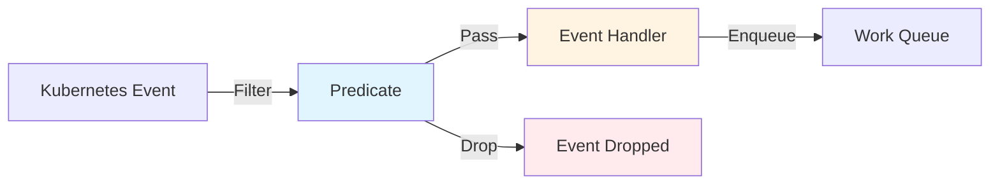

# Predicate Package

## Overview

The `pkg/predicate` package provides filters (predicates) that determine which events should be processed by controllers. Predicates help reduce unnecessary reconciliations by filtering events before they reach the handler.

## Package Location

```
pkg/predicate/
├── predicate.go        # Predicate interfaces and implementations
└── doc.go              # Package documentation
```

## Core Concepts

### Predicate Flow



## Predicate Interface

```go
type Predicate = TypedPredicate[client.Object]

type TypedPredicate[object any] interface {
    // Create returns true if the Create event should be processed
    Create(event.TypedCreateEvent[object]) bool
    
    // Delete returns true if the Delete event should be processed
    Delete(event.TypedDeleteEvent[object]) bool
    
    // Update returns true if the Update event should be processed
    Update(event.TypedUpdateEvent[object]) bool
    
    // Generic returns true if the Generic event should be processed
    Generic(event.TypedGenericEvent[object]) bool
}
```

## Built-in Predicates

### 1. GenerationChangedPredicate

Filters events where only the generation changed (spec changes):

```go
import "sigs.k8s.io/controller-runtime/pkg/predicate"

// Only process when spec changes
ctrl.NewControllerManagedBy(mgr).
    For(&appsv1.Deployment{}, builder.WithPredicates(
        predicate.GenerationChangedPredicate{},
    ))
```

**Use case**: Ignore status-only updates.

**Example**: Deployment status updated → Event dropped

### 2. ResourceVersionChangedPredicate

Filters events where resource version didn't change:

```go
// Process all changes including status
ctrl.NewControllerManagedBy(mgr).
    For(&corev1.Pod{}, builder.WithPredicates(
        predicate.ResourceVersionChangedPredicate{},
    ))
```

**Use case**: Process all updates including status changes.

### 3. AnnotationChangedPredicate

Filters events where annotations didn't change:

```go
// Only process when annotations change
ctrl.NewControllerManagedBy(mgr).
    For(&corev1.Pod{}, builder.WithPredicates(
        predicate.AnnotationChangedPredicate{},
    ))
```

**Use case**: React to annotation changes only.

### 4. LabelChangedPredicate

Filters events where labels didn't change:

```go
// Only process when labels change
ctrl.NewControllerManagedBy(mgr).
    For(&corev1.Pod{}, builder.WithPredicates(
        predicate.LabelChangedPredicate{},
    ))
```

**Use case**: React to label changes only.

### 5. NewPredicateFuncs

Creates a predicate from a simple function:

```go
// Filter by namespace
predicate.NewPredicateFuncs(func(obj client.Object) bool {
    return obj.GetNamespace() == "production"
})
```

**Use case**: Simple filtering based on object properties.

## Using Predicates

### With For Method

```go
ctrl.NewControllerManagedBy(mgr).
    For(&appsv1.Deployment{}, builder.WithPredicates(
        predicate.GenerationChangedPredicate{},
    ))
```

### With Owns Method

```go
ctrl.NewControllerManagedBy(mgr).
    For(&appsv1.Deployment{}).
    Owns(&corev1.Pod{}, builder.WithPredicates(
        predicate.ResourceVersionChangedPredicate{},
    ))
```

### With Watches Method

```go
ctrl.NewControllerManagedBy(mgr).
    For(&appsv1.Deployment{}).
    Watches(
        &corev1.ConfigMap{},
        handler.EnqueueRequestsFromMapFunc(mapFunc),
        builder.WithPredicates(predicate.LabelChangedPredicate{}),
    )
```

### Global Predicates

Apply to all watches:

```go
ctrl.NewControllerManagedBy(mgr).
    For(&appsv1.Deployment{}).
    Owns(&corev1.Pod{}).
    WithEventFilter(predicate.GenerationChangedPredicate{})
```

### Multiple Predicates

Combine multiple predicates (AND logic):

```go
ctrl.NewControllerManagedBy(mgr).
    For(&appsv1.Deployment{}, builder.WithPredicates(
        predicate.GenerationChangedPredicate{},
        predicate.NewPredicateFuncs(func(obj client.Object) bool {
            return obj.GetNamespace() == "production"
        }),
    ))
```

## Custom Predicates

### Using Funcs

```go
import "sigs.k8s.io/controller-runtime/pkg/predicate"

pred := predicate.Funcs{
    CreateFunc: func(e event.CreateEvent) bool {
        // Only process creates in production namespace
        return e.Object.GetNamespace() == "production"
    },
    UpdateFunc: func(e event.UpdateEvent) bool {
        // Only process if generation changed
        return e.ObjectNew.GetGeneration() != e.ObjectOld.GetGeneration()
    },
    DeleteFunc: func(e event.DeleteEvent) bool {
        // Process all deletes
        return true
    },
    GenericFunc: func(e event.GenericEvent) bool {
        // Process all generic events
        return true
    },
}

ctrl.NewControllerManagedBy(mgr).
    For(&appsv1.Deployment{}, builder.WithPredicates(pred))
```

### Implementing Predicate Interface

```go
type MyPredicate struct{}

func (p MyPredicate) Create(e event.CreateEvent) bool {
    return e.Object.GetLabels()["managed-by"] == "my-controller"
}

func (p MyPredicate) Update(e event.UpdateEvent) bool {
    oldLabels := e.ObjectOld.GetLabels()
    newLabels := e.ObjectNew.GetLabels()
    return oldLabels["version"] != newLabels["version"]
}

func (p MyPredicate) Delete(e event.DeleteEvent) bool {
    return true
}

func (p MyPredicate) Generic(e event.GenericEvent) bool {
    return true
}

// Use custom predicate
ctrl.NewControllerManagedBy(mgr).
    For(&appsv1.Deployment{}, builder.WithPredicates(MyPredicate{}))
```

## Predicate Combinators

### And

Combine predicates with AND logic:

```go
pred := predicate.And(
    predicate.GenerationChangedPredicate{},
    predicate.NewPredicateFuncs(func(obj client.Object) bool {
        return obj.GetNamespace() == "production"
    }),
)
```

### Or

Combine predicates with OR logic:

```go
pred := predicate.Or(
    predicate.LabelChangedPredicate{},
    predicate.AnnotationChangedPredicate{},
)
```

### Not

Negate a predicate:

```go
pred := predicate.Not(
    predicate.NewPredicateFuncs(func(obj client.Object) bool {
        return obj.GetNamespace() == "kube-system"
    }),
)
```

## Common Predicate Patterns

### 1. Filter by Namespace

```go
predicate.NewPredicateFuncs(func(obj client.Object) bool {
    return obj.GetNamespace() == "production"
})
```

### 2. Filter by Label

```go
predicate.NewPredicateFuncs(func(obj client.Object) bool {
    labels := obj.GetLabels()
    return labels["managed-by"] == "my-controller"
})
```

### 3. Filter by Annotation

```go
predicate.NewPredicateFuncs(func(obj client.Object) bool {
    annotations := obj.GetAnnotations()
    return annotations["reconcile"] == "true"
})
```

### 4. Ignore Status-Only Updates

```go
predicate.GenerationChangedPredicate{}
```

### 5. Process Only Spec Changes

```go
predicate.Funcs{
    UpdateFunc: func(e event.UpdateEvent) bool {
        oldObj := e.ObjectOld.(*appsv1.Deployment)
        newObj := e.ObjectNew.(*appsv1.Deployment)
        return !reflect.DeepEqual(oldObj.Spec, newObj.Spec)
    },
}
```

### 6. Filter by Owner

```go
predicate.NewPredicateFuncs(func(obj client.Object) bool {
    for _, owner := range obj.GetOwnerReferences() {
        if owner.Kind == "MyResource" {
            return true
        }
    }
    return false
})
```

### 7. Filter by Deletion

```go
predicate.Funcs{
    CreateFunc: func(e event.CreateEvent) bool {
        return e.Object.GetDeletionTimestamp().IsZero()
    },
    UpdateFunc: func(e event.UpdateEvent) bool {
        // Only process if being deleted
        return !e.ObjectNew.GetDeletionTimestamp().IsZero()
    },
}
```

### 8. Filter by Field Value

```go
predicate.NewPredicateFuncs(func(obj client.Object) bool {
    pod := obj.(*corev1.Pod)
    return pod.Spec.NodeName == "node-1"
})
```

### 9. Ignore System Namespaces

```go
predicate.NewPredicateFuncs(func(obj client.Object) bool {
    systemNamespaces := []string{"kube-system", "kube-public", "kube-node-lease"}
    for _, ns := range systemNamespaces {
        if obj.GetNamespace() == ns {
            return false
        }
    }
    return true
})
```

### 10. Paused Annotation

```go
predicate.NewPredicateFuncs(func(obj client.Object) bool {
    annotations := obj.GetAnnotations()
    return annotations["reconcile.paused"] != "true"
})
```

## Advanced Patterns

### Stateful Predicate

```go
type StatefulPredicate struct {
    lastSeen map[string]time.Time
    mu       sync.RWMutex
}

func (p *StatefulPredicate) Update(e event.UpdateEvent) bool {
    p.mu.Lock()
    defer p.mu.Unlock()
    
    key := e.ObjectNew.GetNamespace() + "/" + e.ObjectNew.GetName()
    lastSeen, exists := p.lastSeen[key]
    
    if !exists || time.Since(lastSeen) > 5*time.Minute {
        p.lastSeen[key] = time.Now()
        return true
    }
    
    return false
}

// Implement other methods...
```

### Type-Specific Predicate

```go
func PodReadyPredicate() predicate.Predicate {
    return predicate.Funcs{
        CreateFunc: func(e event.CreateEvent) bool {
            pod := e.Object.(*corev1.Pod)
            return isPodReady(pod)
        },
        UpdateFunc: func(e event.UpdateEvent) bool {
            oldPod := e.ObjectOld.(*corev1.Pod)
            newPod := e.ObjectNew.(*corev1.Pod)
            return isPodReady(oldPod) != isPodReady(newPod)
        },
    }
}

func isPodReady(pod *corev1.Pod) bool {
    for _, cond := range pod.Status.Conditions {
        if cond.Type == corev1.PodReady {
            return cond.Status == corev1.ConditionTrue
        }
    }
    return false
}
```

## Best Practices

### 1. Use GenerationChangedPredicate for Spec Changes

```go
// Ignore status-only updates
predicate.GenerationChangedPredicate{}
```

### 2. Combine Predicates for Complex Logic

```go
predicate.And(
    predicate.GenerationChangedPredicate{},
    predicate.NewPredicateFuncs(func(obj client.Object) bool {
        return obj.GetNamespace() != "kube-system"
    }),
)
```

### 3. Use NewPredicateFuncs for Simple Filters

```go
// Simple namespace filter
predicate.NewPredicateFuncs(func(obj client.Object) bool {
    return obj.GetNamespace() == "production"
})
```

### 4. Handle All Event Types

```go
predicate.Funcs{
    CreateFunc:  func(e event.CreateEvent) bool { return true },
    UpdateFunc:  func(e event.UpdateEvent) bool { return true },
    DeleteFunc:  func(e event.DeleteEvent) bool { return true },
    GenericFunc: func(e event.GenericEvent) bool { return true },
}
```

### 5. Type Assert Safely

```go
predicate.Funcs{
    UpdateFunc: func(e event.UpdateEvent) bool {
        pod, ok := e.ObjectNew.(*corev1.Pod)
        if !ok {
            return false
        }
        // Use pod
        return true
    },
}
```

## Common Pitfalls

### 1. Forgetting Event Types

```go
// BAD - only handles updates
predicate.Funcs{
    UpdateFunc: func(e event.UpdateEvent) bool {
        return true
    },
    // Missing Create, Delete, Generic
}

// GOOD - handle all types
predicate.Funcs{
    CreateFunc:  func(e event.CreateEvent) bool { return true },
    UpdateFunc:  func(e event.UpdateEvent) bool { return true },
    DeleteFunc:  func(e event.DeleteEvent) bool { return true },
    GenericFunc: func(e event.GenericEvent) bool { return true },
}
```

### 2. Type Assertion Without Check

```go
// BAD - panics if wrong type
pod := e.ObjectNew.(*corev1.Pod)

// GOOD - safe type assertion
pod, ok := e.ObjectNew.(*corev1.Pod)
if !ok {
    return false
}
```

### 3. Expensive Predicate Logic

```go
// BAD - API calls in predicate
predicate.Funcs{
    UpdateFunc: func(e event.UpdateEvent) bool {
        var list corev1.PodList
        c.List(ctx, &list) // Expensive!
        return true
    },
}

// GOOD - simple checks only
predicate.Funcs{
    UpdateFunc: func(e event.UpdateEvent) bool {
        return e.ObjectNew.GetGeneration() != e.ObjectOld.GetGeneration()
    },
}
```

## Performance Considerations

### Predicate Efficiency

Predicates are called for every event, so they should be:
- **Fast**: Avoid expensive operations
- **Stateless**: Don't rely on external state
- **Simple**: Keep logic straightforward

### Reducing Reconciliations

Use predicates to reduce unnecessary reconciliations:

```go
// Without predicate: reconcile on every update
ctrl.NewControllerManagedBy(mgr).
    For(&appsv1.Deployment{})

// With predicate: reconcile only on spec changes
ctrl.NewControllerManagedBy(mgr).
    For(&appsv1.Deployment{}, builder.WithPredicates(
        predicate.GenerationChangedPredicate{},
    ))
```

This can reduce reconciliations by 50-90% in typical scenarios.

## Related Packages

- [Source Package](./07-source.md) - Generates events filtered by predicates
- [Handler Package](./08-handler.md) - Processes events that pass predicates
- [Controller Package](./02-controller.md) - Uses predicates
- [Builder Package](./04-builder.md) - Configures predicates
