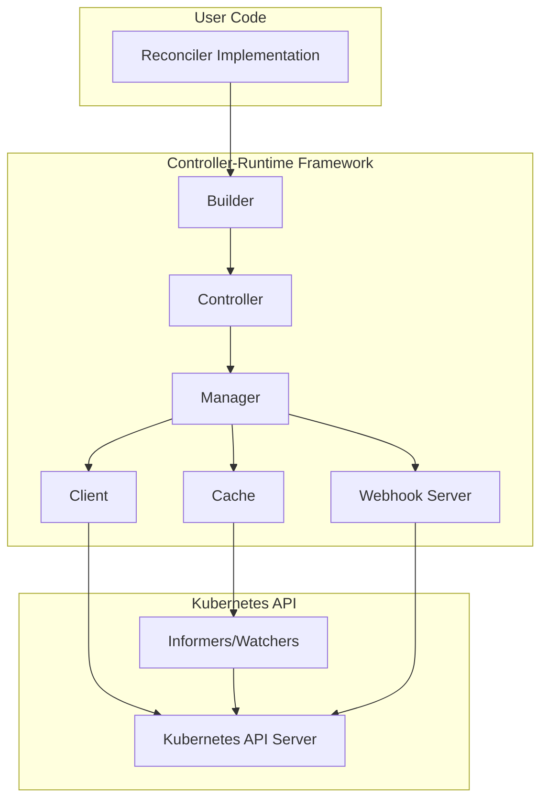

# Controller-Runtime Documentation

This directory contains comprehensive documentation for the Kubernetes controller-runtime project.

## Documentation Structure

### Core Documentation

1. **[Architecture Overview](./00-overview.md)** - High-level architecture and design principles
2. **[Manager Package](./01-manager.md)** - Central orchestrator for controllers and webhooks
3. **[Controller Package](./02-controller.md)** - Controller implementation and work queue management
4. **[Reconcile Package](./03-reconcile.md)** - Reconciler interface and reconciliation patterns
5. **[Builder Package](./04-builder.md)** - Fluent API for building controllers
6. **[Client Package](./05-client.md)** - Kubernetes API client interface
7. **[Cache Package](./06-cache.md)** - Object caching with informers
8. **[Source Package](./07-source.md)** - Event sources for controllers
9. **[Handler Package](./08-handler.md)** - Event handlers for processing events
10. **[Predicate Package](./09-predicate.md)** - Event filtering predicates
11. **[Webhook Package](./10-webhook.md)** - Admission and conversion webhooks
12. **[Additional Packages](./11-additional-packages.md)** - Supporting packages

## Quick Start

### Basic Controller Example

```go
package main

import (
    "context"
    "os"
    
    corev1 "k8s.io/api/core/v1"
    ctrl "sigs.k8s.io/controller-runtime"
    "sigs.k8s.io/controller-runtime/pkg/client"
    "sigs.k8s.io/controller-runtime/pkg/log"
    "sigs.k8s.io/controller-runtime/pkg/log/zap"
)

type PodReconciler struct {
    client.Client
}

func (r *PodReconciler) Reconcile(ctx context.Context, req ctrl.Request) (ctrl.Result, error) {
    log := log.FromContext(ctx)
    
    var pod corev1.Pod
    if err := r.Get(ctx, req.NamespacedName, &pod); err != nil {
        return ctrl.Result{}, client.IgnoreNotFound(err)
    }
    
    log.Info("Reconciling Pod", "name", pod.Name)
    
    return ctrl.Result{}, nil
}

func main() {
    ctrl.SetLogger(zap.New())
    
    mgr, err := ctrl.NewManager(ctrl.GetConfigOrDie(), ctrl.Options{})
    if err != nil {
        os.Exit(1)
    }
    
    err = ctrl.NewControllerManagedBy(mgr).
        For(&corev1.Pod{}).
        Complete(&PodReconciler{
            Client: mgr.GetClient(),
        })
    if err != nil {
        os.Exit(1)
    }
    
    if err := mgr.Start(ctrl.SetupSignalHandler()); err != nil {
        os.Exit(1)
    }
}
```

## Key Concepts

### Level-Based Reconciliation

Controller-runtime uses level-based reconciliation, meaning controllers reconcile based on the current state of the system, not individual events. This makes controllers:

- **Resilient**: Missed events don't cause problems
- **Self-healing**: Controllers continuously converge to desired state
- **Idempotent**: Multiple reconciliations produce the same result

### Separation of Concerns

The framework separates different aspects of controller logic:

- **Source**: Where events come from (e.g., Kubernetes API)
- **Handler**: How to transform events into reconcile requests
- **Predicate**: Which events to process
- **Reconciler**: What to do with the reconcile request

### Shared Dependencies

The Manager provides shared dependencies to all controllers:

- **Cache**: Shared in-memory cache of Kubernetes objects
- **Client**: Unified client for API operations
- **Scheme**: Type registration for serialization
- **REST Mapper**: Mapping between Go types and API resources

## Architecture Diagram



## Common Use Cases

### 1. Custom Resource Controller

Build a controller for your Custom Resource Definition (CRD):

```go
err := ctrl.NewControllerManagedBy(mgr).
    For(&myv1.MyResource{}).
    Owns(&corev1.Pod{}).
    Owns(&corev1.Service{}).
    Complete(&MyResourceReconciler{})
```

### 2. Built-in Resource Controller

Watch and react to built-in Kubernetes resources:

```go
err := ctrl.NewControllerManagedBy(mgr).
    For(&corev1.Pod{}).
    Complete(&PodReconciler{})
```

### 3. Multi-Resource Controller

Watch multiple related resources:

```go
err := ctrl.NewControllerManagedBy(mgr).
    For(&myv1.MyResource{}).
    Watches(&corev1.ConfigMap{}, 
        handler.EnqueueRequestsFromMapFunc(mapFunc)).
    Watches(&corev1.Secret{},
        handler.EnqueueRequestsFromMapFunc(mapFunc)).
    Complete(&MyResourceReconciler{})
```

### 4. Admission Webhook

Implement validating and mutating webhooks:

```go
err := ctrl.NewWebhookManagedBy(mgr).
    For(&myv1.MyResource{}).
    WithDefaulter(&MyResourceDefaulter{}).
    WithValidator(&MyResourceValidator{}).
    Complete()
```

## Best Practices

### 1. Idempotent Reconciliation

Ensure your reconcile logic can be called multiple times safely:

```go
func (r *MyReconciler) Reconcile(ctx context.Context, req ctrl.Request) (ctrl.Result, error) {
    // Check if work is already done
    if isAlreadyDone() {
        return ctrl.Result{}, nil
    }
    
    // Do work
    return ctrl.Result{}, nil
}
```

### 2. Handle Deletion with Finalizers

Use finalizers for cleanup when objects are deleted:

```go
if !obj.DeletionTimestamp.IsZero() {
    if controllerutil.ContainsFinalizer(obj, myFinalizer) {
        // Perform cleanup
        if err := cleanup(); err != nil {
            return ctrl.Result{}, err
        }
        // Remove finalizer
        controllerutil.RemoveFinalizer(obj, myFinalizer)
        return ctrl.Result{}, r.Update(ctx, obj)
    }
    return ctrl.Result{}, nil
}

// Add finalizer if not present
if !controllerutil.ContainsFinalizer(obj, myFinalizer) {
    controllerutil.AddFinalizer(obj, myFinalizer)
    return ctrl.Result{}, r.Update(ctx, obj)
}
```

### 3. Update Status Separately

Always update status using the status subresource:

```go
// Update spec
if err := r.Update(ctx, obj); err != nil {
    return ctrl.Result{}, err
}

// Update status
if err := r.Status().Update(ctx, obj); err != nil {
    return ctrl.Result{}, err
}
```

### 4. Use Predicates to Filter Events

Reduce unnecessary reconciliations:

```go
err := ctrl.NewControllerManagedBy(mgr).
    For(&myv1.MyResource{}, builder.WithPredicates(
        predicate.GenerationChangedPredicate{},
    )).
    Complete(&MyResourceReconciler{})
```

### 5. Enable Leader Election for HA

Run multiple replicas with leader election:

```go
mgr, err := ctrl.NewManager(cfg, ctrl.Options{
    LeaderElection: true,
    LeaderElectionID: "my-controller-lock",
})
```

## Testing

### Unit Testing with Fake Client

```go
import "sigs.k8s.io/controller-runtime/pkg/client/fake"

func TestReconcile(t *testing.T) {
    scheme := runtime.NewScheme()
    _ = corev1.AddToScheme(scheme)
    
    fakeClient := fake.NewClientBuilder().
        WithScheme(scheme).
        WithObjects(&pod).
        Build()
    
    reconciler := &MyReconciler{
        Client: fakeClient,
    }
    
    result, err := reconciler.Reconcile(ctx, req)
    // Assert result and err
}
```

### Integration Testing with envtest

```go
import "sigs.k8s.io/controller-runtime/pkg/envtest"

func TestControllerIntegration(t *testing.T) {
    testEnv := &envtest.Environment{
        CRDDirectoryPaths: []string{"./config/crd"},
    }
    
    cfg, err := testEnv.Start()
    defer testEnv.Stop()
    
    // Create manager and controller
    // Run tests
}
```

## Troubleshooting

### Common Issues

1. **Cache not synced**: Increase `CacheSyncTimeout`
2. **High memory usage**: Use `OnlyMetadata` watches
3. **Slow reconciliation**: Increase `MaxConcurrentReconciles`
4. **Missed events**: Check predicates aren't too restrictive
5. **Conflicts on update**: Use `Patch` instead of `Update`

### Debugging

Enable verbose logging:

```go
import "sigs.k8s.io/controller-runtime/pkg/log/zap"

ctrl.SetLogger(zap.New(zap.UseDevMode(true)))
```

## Resources

### Official Documentation

- [Kubebuilder Book](https://book.kubebuilder.io/)
- [Controller-Runtime GoDoc](https://pkg.go.dev/sigs.k8s.io/controller-runtime)
- [GitHub Repository](https://github.com/kubernetes-sigs/controller-runtime)

### Examples

- [Built-in Resources Example](../examples/builtins/)
- [CRD Example](../examples/crd/)
- [Typed Controller Example](../examples/typed/)

### Community

- [Kubernetes Slack #controller-runtime](https://kubernetes.slack.com/archives/C02MRBMN00Z)
- [Kubebuilder Google Group](https://groups.google.com/forum/#!forum/kubebuilder)

## Contributing

See [CONTRIBUTING.md](../../CONTRIBUTING.md) for guidelines on contributing to controller-runtime.

## License

Controller-runtime is licensed under the Apache License 2.0. See [LICENSE](../../LICENSE) for details.
